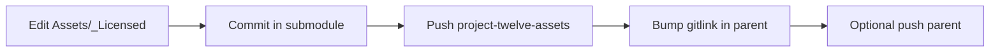

# Publish assets submodule (project-twelve-assets → project-twelve)

> **Submodule:** [project-twelve-assets](https://github.com/synthet/project-twelve-assets) at `Assets/_Licensed/`.
> **Script:** `scripts/publish_assets_submodule.py` (Windows: `scripts\publish_assets_submodule.bat`).

## When to use

- After editing **licensed docs**, catalogs, or art under `Assets/_Licensed/`.
- User asks to **commit assets submodule**, **bump submodule pointer**, or **publish licensed docs**.
- Before opening a PR that depends on a new assets commit (parent must record the gitlink).

## Assets-first workflow



1. Change files in `Assets/_Licensed/` (the submodule checkout).
2. **Publish** — commit + push submodule, then bump parent gitlink.
3. Open PR in **project-twelve** with the pointer commit (and any public `docs/` changes).

## Commands

**Status** (submodule HEAD vs parent gitlink):

```bash
python scripts/publish_assets_submodule.py --status
```

**Full publish** (commit if dirty, push submodule, bump parent):

```bash
python scripts/publish_assets_submodule.py \
  -m "docs: refine licensed asset inventory" \
  --submodule-checkout main \
  --pull-submodule
```

**Bump only** (submodule already pushed; align parent to `main` tip):

```bash
python scripts/publish_assets_submodule.py \
  --submodule-checkout main \
  --pull-submodule \
  --skip-submodule-push \
  --parent-message "chore(assets): bump Assets/_Licensed for docs inventory"
```

**Dry run:**

```bash
python scripts/publish_assets_submodule.py --dry-run --submodule-checkout main -m "docs: example"
```

Windows:

```bat
scripts\publish_assets_submodule.bat --status
scripts\publish_assets_submodule.bat -m "docs: update licensed inventory" --submodule-checkout main --pull-submodule
```

## Flags (common)

| Flag | Purpose |
|------|---------|
| `--status` | Show alignment only; no writes |
| `-m` / `--message` | Submodule commit message when working tree is dirty |
| `--submodule-checkout BRANCH` | Leave detached HEAD; use `main` before pull/commit |
| `--pull-submodule` | `git pull --ff-only` in submodule after checkout |
| `--skip-submodule-push` | Only bump parent (submodule already on remote) |
| `--skip-parent-commit` | Only push submodule; no parent gitlink commit |
| `--push-parent` | `git push` parent branch after gitlink commit |
| `--dry-run` | Print planned git commands |

## Safety

- Submodule commits live in **project-twelve-assets** only — never stage licensed blobs into the public tree.
- Parent gitlink bump runs `python3 scripts/check_paid_assets.py --staged` before commit.
- Do **not** use `git submodule update --remote` unless you intend to advance the recorded SHA.
- For fetch/pull without publishing, use [`repo-sync`](../repo-sync/SKILL.md) / `/fetch-remotes`.

## Documentation map

| Location | Contents |
|----------|----------|
| `Assets/_Licensed/docs/README.md` | Submodule doc hub |
| `Assets/_Licensed/docs/vendor/` | Vendor API + asset catalogs |
| `Assets/_Licensed/docs/integration/` | Catalog regen + ProjectTwelve wiring |
| `docs/wiki/licensed-assets-reference.md` | Public index (no full asset lists) |

## Related

- [`docs/PAID_ASSETS.md`](../../../docs/PAID_ASSETS.md)
- Skill: [`repo-sync`](../repo-sync/SKILL.md)
- Slash command: `.claude/commands/publish-assets-submodule.md`
