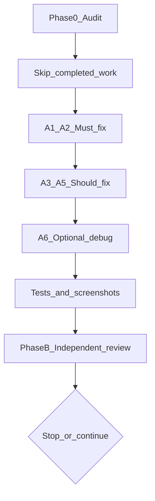

# HUD polish — consolidated agent prompt

You are an agentic coding assistant working inside **ProjectTwelve**, a Unity 6 (`6000.5.1f1`) Terraria-like 2D sandbox prototype.

This document **supersedes** these historical prompts (do not follow them if they conflict with this file):

- `codex-polish-projecttwelve-hud.md` — first implementation pass
- `codex-final-hud-polish.md` — micro-polish after partial pass
- `hud-polish-micro-pass-2.md` — completion pass with strict acceptance criteria
- `independent-hud-second-opinion-prompt.md` — review-only gate (now Phase B below)

Attach the **latest Game View screenshot** when starting work. Baseline screenshots from 2026-07-11 show an ornate-frame HUD with a two-row health panel, ornamental hotbar rails, and a framed item label above the active slot.

## Final follow-up (current work)

**If the structural polish pass is already done** (single-row health panel, hotbar rails removed, item label behavior in place), use **[`hud-fix-health-frame.md`](hud-fix-health-frame.md)** instead of Phase A below. That prompt is the **final HUD task**: repair the distorted health panel frame (9-slice borders, width tightening, bottom-right artifact). It supersedes any conflicting item in this document — notably, **do not reintroduce numeric health** when executing the frame fix.

When the frame fix is verified, the HUD polish effort is **closed**.

## Conflict resolution

When earlier prompts disagree, apply this priority order:

1. **[`hud-fix-health-frame.md`](hud-fix-health-frame.md)** when structural polish is complete — frame repair only; no numeric health readout.
2. **Strict structural acceptance criteria** — health panel is exactly one row: `[portrait] [hearts]` (numeric optional; omitted in final design).
3. **Preserve fantasy frame art** — resize via 9-slice; do not replace the visual identity or globally scale the Canvas.
4. **Micro-adjustments** — 5–10% width trim, label proximity, debug padding — only after structural fixes.
5. **Do-not-redo list** — derive from repository evidence (`git diff`, code, tests), not from prompt claims alone.



---

## Project contract

Before changing anything:

1. Read [`AGENTS.md`](../../AGENTS.md).
2. Read [`CLAUDE.md`](../../CLAUDE.md).
3. Read [`.agent-memory/memory.md`](../../.agent-memory/memory.md), or run:
   ```bash
   python scripts/agent-memory/context.py
   ```
4. Read:
   - [`docs/CANONICAL_SOURCES.md`](../CANONICAL_SOURCES.md)
   - [`docs/PAID_ASSETS.md`](../PAID_ASSETS.md)
   - relevant HUD/UI docs and Ready-stage tickets under [`docs/wiki/`](../wiki/)
5. Inspect the current HUD before editing:
   - [`Assets/Prefabs/UI/SandboxHUD.prefab`](../../Assets/Prefabs/UI/SandboxHUD.prefab)
   - [`Assets/Scripts/Sandbox/UI/SandboxHudController.cs`](../../Assets/Scripts/Sandbox/UI/SandboxHudController.cs)
   - Generated sprites under [`Assets/Sprites/UI/Generated/`](../../Assets/Sprites/UI/Generated/)
6. Prefer repository evidence over assumptions. Do not invent prefab paths, component names, serialized fields, or UI conventions.

**HUD architecture notes:**

- The HUD is **runtime-built** in `SandboxHudController.BuildView()` — layout changes are primarily in that script, not manual scene hierarchy edits.
- Canvas: Screen Space Overlay, reference resolution 1280×720, `pixelPerfect: 1` on the prefab.
- Theme sprites wired on the prefab: `panelSprite`, `frameSprite`, `selectionSprite`, `slotSprite`, hearts, portrait, tile icons, `pixelFont`.

If there is a relevant Ready-stage HUD ticket, work from it and reference the linked issue. Do not silently create new project governance.

---

## Phase 0 — Scope audit (mandatory first step)

Do this before any edits.

1. Run `git log` and `git diff` since the last HUD polish pass.
2. If any non-HUD code was touched (player rendering, sprites, terrain, autotile, input), report exactly what changed. Do not silently keep or revert — document it at the top of your summary.
3. Confirm which HUD files were actually modified so edits build on the real current state.
4. Measure and report current panel sizes (from code or instantiated prefab):
   - Vitals panel (WIP baseline: ~210×70 px)
   - Hotbar (WIP baseline: ~612×60 px)
   - Debug telemetry (WIP baseline: ~160×62 px)
5. Classify each requirement below as **DONE**, **PARTIAL**, **NOT DONE**, or **REGRESSION**.

### Current-state ledger (baseline as of consolidation)

Use repo evidence to confirm or update this table at audit time:

| Item | Baseline status | Evidence |
|------|-----------------|----------|
| Item label follows selected slot | DONE | `PositionSelectedItemLabel`; test asserts label parent is active slot |
| Item label fade ~1.5–2 s | DONE | `SelectedItemLabelDurationSeconds` (1.75 s), `UpdateSelectedItemLabelVisibility` |
| Item label contrast backing | PARTIAL | `ItemLabelTint` + text `Shadow`; verify over brightest terrain |
| Selected slot emphasis | PARTIAL | Four gold corner markers + 2 px upward lift; verify over bright/dark terrain |
| Debug `DEBUG` prefix + toggle | PARTIAL | `FormatWorldInfo`, `SetDebugTelemetryVisible`; padding reduced |
| Health panel single-row (portrait + hearts) | DONE | `BuildVitalsPanel` single row; no `HealthValue` text node |
| Health panel frame quality | **REGRESSION** | Distorted 9-slice corners, trailing empty strip — see [`hud-fix-health-frame.md`](hud-fix-health-frame.md) |
| Pixel density audit | PARTIAL | Generated sprites at PPU 100; verify import settings per asset |
| Hotbar ornamental rails | DONE | Hotbar uses flat `HotbarTint`; slot height driven by slots |
| Overall footprint reduction | PARTIAL | Vitals 320×92→210×70, hotbar height 82→60 |

**Do not redo completed work** unless audit proves it regressed.

---

## Phase A — Implementation

**Primary goal:** Finish HUD polish so the overlay feels intentional and subordinate to the game world — not several large framed windows competing with terrain and the player. This is a **completion pass**, not a full redesign.

### A1 — Health panel single-row collapse (MUST)

The previous partial pass failed this task by relocating or removing the numeric readout instead of restructuring the panel.

**Required end state — all must be true:**

1. The panel contains exactly **one horizontal row** of content: `[portrait] [hearts row] [current / max]`, vertically centered, left to right.
2. The numeric health text sits **on the same baseline band as the hearts**, immediately to their right — not above, not below, not in a corner.
3. The panel frame height wraps that single row plus frame padding. There must be **no empty framed region large enough to fit another hearts row**.
4. The panel total width is **60–70% of the pre-pass width (~320 px)** — target roughly 192–224 px. Measure and report before and after in pixels.
5. Existing frame art is preserved via 9-slice resizing, not replaced.

If 9-slice borders make exact proportions impossible, get as close as slicing allows and report the constraint — do not abandon the single-row requirement.

**Explicitly not acceptable:** moving or restyling text while keeping a two-row panel; shrinking by scale factor while keeping empty space; hiding empty space with decoration; **removing numeric health**.

Update [`Assets/Tests/EditMode/SandboxHudTests.cs`](../../Assets/Tests/EditMode/SandboxHudTests.cs) to assert `Vitals/HealthValue` exists and vitals bounds match the new contract.

### A2 — Pixel density unification (MUST)

1. Determine the world art's effective pixel scale (tile PPU × camera/canvas scaling).
2. Report the effective pixel scale of: frame sprites, portrait, hearts, and hotbar art. Name mismatches with numbers **before** fixing anything.
3. Bring HUD sprites onto one consistent effective grid. Priority: portrait and its frame must share one resolution — if the portrait cannot be redrawn, match the frame to the portrait's chunkier grid, not the reverse.
4. Verify import settings: Filter Mode = Point, compression = none, correct PPU.
5. Verify no HUD element sits at fractional positions at the reference resolution; fix non-integer anchored positions. Keep `pixelPerfect` enabled on the Canvas where supported.

### A3 — Hotbar rail trim (SHOULD)

- Remove or flatten the ornamental bars with center medallions above and below the slot row so hotbar height is driven by the slots themselves.
- If rails are baked into one sprite (`hud_panel_main.png`, slot sprites), re-slice or crop; if separate objects, disable or delete them.
- Report before/after hotbar pixel height. Selected-slot emphasis must remain unmistakable afterward.

### A4 — Selected slot clarity (SHOULD)

The selected slot must be obvious within one glance during gameplay.

Strengthen or verify using restrained pixel-art cues only:

- Brighter 1–2 px inner border or corner markers (partially implemented)
- 1–2 px upward lift on the selected slot (partially implemented)
- Slightly higher contrast behind the selected icon
- Existing selection frame art (`selectionSprite`)

**Avoid:** soft bloom, blurred glow, smooth gradients, large scaling animations, continuous pulsing.

The selected state must remain readable over both bright and dark terrain.

### A5 — Item label finish (SHOULD)

**Do not change** slot-tracking logic (`PositionSelectedItemLabel`).

1. **Contrast:** ensure the label is readable over grass, sky, and snow — not just dark dirt. The semi-transparent backing and text shadow may suffice; verify over the brightest terrain available and report.
2. **Proximity:** move the label closer to the selected slot if needed (WIP offset: 8 px above slot; try 4–6 px if the frame allows). Do not restore the previous large framed item-name panel.
3. **Timing:** label appears on slot change and fades/hides after ~1.5–2 s. If already implemented, verify in code, state where, and leave alone.

### A6 — Debug telemetry de-theme (OPTIONAL)

Only after A1–A5 are complete and verified:

- Plain small monospace font (built-in allowed)
- Semi-transparent dark background (no ornate frame)
- Visible `DEBUG` prefix (partially done in `FormatWorldInfo`)
- Compact internal padding (~15–20% reduction where safe)
- Toggle via existing `showDebugTelemetry` serialized bool or compile flag

Do not add a new debug framework. Do not remove seed/tile/chunk data.

---

## Phase A — Constraints

- **Scope:** HUD presentation only. Do not touch player, terrain, autotiling, input, world simulation, inventory rules, or save data.
- **Minimal diffs:** smallest change that satisfies each criterion; no refactoring of working HUD code.
- **No new packages** or fonts beyond project contents.
- **No global Canvas scale** as a spacing shortcut.
- **No licensed binary commits** under `Assets/_Licensed/`.
- **Preserve** Unity `.meta` files with every asset change.
- **One focused commit per task** with a clear message.
- **Architecture:** hotbar selection logic stays in state layer; HUD scripts only present current state; debug telemetry remains read-only; item-name positioning must not mutate inventory or world state.

### Pixel-art constraints

- Point filtering and crisp edges.
- Avoid fractional transforms that blur sprites or text.
- Anchor visual composition by **sprite bounds**, not assumed pivots.
- Preserve the fantasy gold/metal frame style on production HUD elements.
- Do not introduce modern soft-shadow or glassmorphism aesthetics.

### Multi-resolution checks

After all tasks, verify at minimum:

- 1920×1080 (16:9)
- 2560×1440 or another high-resolution 16:9
- 16:10
- Ultrawide or representative wider aspect
- A narrower window where the hotbar still fits

Confirm:

- Vitals panel remains top-left anchored
- Debug panel remains top-right anchored
- Hotbar remains bottom-center anchored
- Selected-item label tracks the selected slot correctly
- No overlap between corner panels and hotbar
- Margins remain visually consistent

Existing EditMode coverage: `HudLayout_FitsRepresentativeAspectRatios` in [`SandboxHudTests`](../../Assets/Tests/EditMode/SandboxHudTests.cs).

---

## Phase A — Mandatory reporting format

Failure to report in this format counts as task failure. For **each** task (A1–A6), output:

```
### Task A<N> — <name>
Status: DONE | PARTIAL | BLOCKED
Files changed: <list>
Before: <concrete measurement or description>
After: <concrete measurement or description>
Evidence: <how you verified — screenshot, inspector values, code reference>
Deviations: <anything done differently than specified, and why>
```

Do not mark a task **DONE** unless every acceptance criterion for that task is satisfied. If **BLOCKED**, state the exact obstacle and the two smallest viable alternatives — do not improvise a different interpretation.

Include before/after Game View screenshots with comparable composition.

---

## Phase A — Testing

Run the relevant repository checks.

At minimum:

```bash
Unity -batchmode -quit -projectPath . -logFile Logs/unity-validate.log
Unity -batchmode -projectPath . -runTests -testPlatform EditMode -testResults TestResults/editmode.xml -logFile Logs/unity-editmode-tests.log
python3 scripts/check_paid_assets.py --staged
```

Target EditMode tests: `SandboxHudTests` (prefab fixture, heart fill, world info format, label expiry, aspect-ratio layout).

For the full EditMode suite on Windows, follow [`.claude/skills/unity-tests/SKILL.md`](../../.claude/skills/unity-tests/SKILL.md) (omit `-quit` with `-runTests` on Windows).

Add tests only for new non-visual logic that can be meaningfully tested outside Unity rendering.

Autotile and terrain tests are **not** required unless this task unexpectedly touches those systems.

If documentation changes:

```bash
python3 scripts/check_markdown_links.py
python3 scripts/okf_lint.py --profile project --exclude-prefix archive/ docs
python3 scripts/wiki_lint.py --exclude-prefix archive/
```

### Phase A acceptance criteria

Phase A is complete when:

1. Health panel is a single row with portrait, hearts, and numeric health; no dead second row.
2. HUD sprites share a consistent effective pixel grid (audit report included).
3. Hotbar height is slot-driven; ornamental rails removed or flattened (A3 DONE or PARTIAL with deviation).
4. Selected hotbar slot is immediately recognizable.
5. Item-name label has adequate contrast, correct timing, and appropriate proximity to the active slot.
6. Debug telemetry reads as development overlay, not production HUD (A6 optional).
7. HUD elements remain crisp and correctly anchored across tested aspect ratios.
8. No gameplay, inventory, world, autotile, persistence, or input behavior changes.
9. No paid/licensed asset content is added to the public repository.
10. Unity validation passes, or unrelated pre-existing failures are documented with exact logs.

---

## Phase B — Independent review gate

After Phase A is complete and validated, perform or request an **independent review** using a **post-implementation screenshot only**. Do not anchor on prior scores or opinions. Do not assume previous reviewers were correct.

This is a critique task. Do not write code unless the review reveals a clear must-fix regression.

### Review goals

Evaluate the HUD in these areas:

1. **Visual hierarchy** — what attracts attention first; does the HUD compete with player or terrain; are core gameplay elements emphasized correctly?
2. **Composition and spacing** — consistent margins; unused or awkward empty space; balance across the screen.
3. **Health panel** — size justified by contents; portrait, hearts, and numeric health grouped well; no redundant or poorly positioned information.
4. **Hotbar** — appropriate scale; selected slot obvious at a glance; icons, counts, borders, and slot spacing readable; does not obscure too much of the world.
5. **Selected-item label** — clearly connected to the active slot; not too detached, close, small, or prominent; temporary vs permanent presentation appropriate.
6. **Debug telemetry** — reads as debug information; background, padding, font size, and contrast appropriate; visually subordinate.
7. **Pixel-art consistency** — borders, text, icons, and spacing coherent with the game; no blurry scaling or fractional alignment.
8. **Responsiveness risk** — what may break on 16:10, ultrawide, or narrow windows; which anchors or dimensions need verification.

### Required review response format

#### Overall verdict

Give a direct verdict in 2–4 sentences. State whether the HUD is:

- not ready;
- functional but unfinished;
- polished with minor issues;
- production-ready.

#### Score

Rate from **1 to 10** and explain briefly.

#### What works

List the strongest aspects with visible evidence.

#### What still feels wrong

Identify concrete issues. For each:

- what is wrong;
- where it appears;
- why it matters during gameplay;
- severity: critical, major, moderate, or minor.

Avoid vague comments such as "needs more polish."

#### Prioritized recommendations

Provide no more than five recommendations, ordered by impact, separated into:

- **Must fix**
- **Should fix**
- **Optional polish**

Use approximate pixel or percentage adjustments only when the screenshot supports them.

#### Stop-or-continue decision

End with one of:

- **Stop:** HUD is sufficiently polished; further changes risk overworking it.
- **One more micro-pass:** only small targeted adjustments remain.
- **Another structural pass:** hierarchy or layout still needs meaningful rework.

Explain the choice.

### Review rules

- Be candid. Do not flatter the developer.
- Do not recommend changing the entire art style unless there is strong visual reason.
- Prefer minimal, high-impact adjustments over broad redesign.
- Distinguish real usability problems from personal taste.
- Call out uncertainty where a static screenshot is insufficient.
- Do not comment on autotiling, terrain generation, or gameplay systems unless they directly affect HUD readability.

---

## Completion definition

The full consolidated prompt is satisfied when:

1. **Phase A:** all MUST tasks (A1, A2) are **DONE**; all SHOULD tasks (A3–A5) are **DONE** or **PARTIAL** with documented deviations; A6 is optional.
2. **Final frame fix:** [`hud-fix-health-frame.md`](hud-fix-health-frame.md) is **DONE** — health panel frame is pixel-crisp and content-tight.
3. **Phase B:** independent reviewer recommends **Stop** or **One more micro-pass** (not **Another structural pass**).
4. Final agent response includes:
   - concise summary;
   - exact changed files;
   - before/after screenshots;
   - tests run and results;
   - remaining limitations;
   - issue/PR linkage with `Closes #N` when applicable.

When finished, declare the pass complete. Do not propose open-ended further HUD work unless Phase B explicitly recommends **One more micro-pass** with enumerated items.

## Important cautions

- Do not hand-edit generated `.cursor/` content.
- Do not modify `.git/config`.
- Do not weaken paid-asset or safety guards.
- Do not commit machine-specific paths.
- Do not replace the existing visual identity with generic modern UI.
- Do not over-animate the HUD.
- Do not solve spacing problems by globally scaling everything without checking pixel alignment.
- Do not change autotile logic as part of this task.
