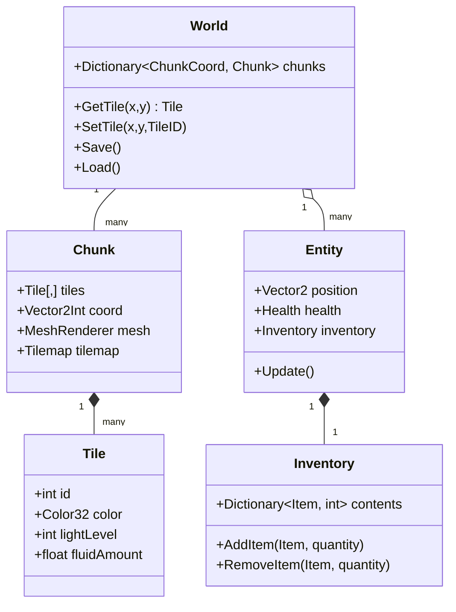

# Unity 2D Sandbox Architecture — Detailed Design Reference

> This is an expanded companion to [`terraria-like-unity-design.md`](./terraria-like-unity-design.md).
> It covers the same architecture in greater depth, with additional code sketches,
> comparison tables, algorithm pseudocode, and milestone breakdowns.

## Executive Summary

Unity can indeed support a 2D sandbox game like *Terraria* or *Starbound*, but doing so requires careful design. You'll need a **chunked tile system** for world data (to avoid huge monolithic tilemaps), combined with efficient **rendering and physics**. Unity's built-in **Tilemap** system can help with drawing static layers, but for a destructible world you generally manage your own tile/mesh chunks (since the Tilemap's internal "chunks" only cull rendered tiles). Colliders must be handled per-chunk rather than with one giant composite, because a single **CompositeCollider2D** merging all tile shapes is extremely slow for dynamic changes. Similarly, for *lighting* and *liquids*, you'll implement custom solutions: e.g. a flood-fill light map (propagating light values from light sources with falloff), and a cellular-automaton water simulator (each cell holds a fluid amount and flows downward/sideways/upward by simple rules).

Networking will require a **server-authoritative** model: clients send input and tile-edit requests, the server validates and broadcasts tile changes. Popular Unity choices include **Mirror** (open-source, free, UNET-based) or Unity's official **Netcode for GameObjects (NGO)**; Photon (PUN/Fusion) is also common but is a hosted relay model with limited free CCU. In summary, this design document outlines a modular architecture with data classes for *Tile, Chunk, World, Entity, Inventory*, etc., describes chunking (e.g. 16×16 or 32×32), rendering options (Tilemaps vs custom meshes vs GPU instancing) and lighting propagation pseudocode, as well as generation (noise, cellular caves, biomes, structures), liquid CA rules, pathfinding (A*/FOV on a grid), physics integration (avoid big CompositeCollider2D), networking sync patterns, savefile strategies, mod pipelines, tools, testing, and a rough schedule.

## Goals and Scope

We assume an open-ended design (platforms and team size unspecified). The goal is a **2D side-scrolling sandbox** with fully destructible terrain, biomes, day/night, and optional multiplayer. If aiming for a **prototype**, focus on core engine systems (chunked world, tile editing, basic generation, collision, simple lighting). For a **full game**, all listed features (liquids, advanced lighting, multiplayer, mod tools, etc.) should be implemented. Here we cover both scope levels; a small team or solo dev could first aim for a vertical slice (core mechanics) and iterate toward alpha/beta as outlined below.

## Architecture Overview

At a high level, the world is divided into **Chunks** (e.g. 16×16 or 32×32 tile regions) that hold tile data and optionally a mesh or Tilemap for rendering. The **World** class manages these chunks (loading/unloading around the player). Each **Tile** holds its ID/type and any state (e.g. metadata for frames, light level, fluid amount). **Entities** (player, NPCs, monsters) reference the world grid for collision.

A simplified class diagram (in Mermaid) might look like:



Each **Chunk** has its own GameObject (or is managed in one object with sub-meshes); it may use Unity's **TilemapRenderer/TilemapCollider2D** for drawing, or a custom mesh (see Rendering). Entities and inventory are standard game object classes. The **save file** records chunk contents (tile IDs, light, fluid) and entity state (position, health, inventory). A version number is stored for forward compatibility.

## Data Models (C# sketches)

- **Tile**
  ```csharp
  public struct Tile {
      public int id;             // index into tile registry
      public Color32 color;      // for tintable tiles, or used as lighting store
      public byte light;         // light level (0-15 or 0-255)
      public float fluid;        // 0.0-1.0 amount in this tile (for liquids)
  }
  ```
- **Chunk** (e.g. 32×32 tiles)
  ```csharp
  public class Chunk {
      public const int Size = 32;
      public Vector2Int coord;      // chunk coordinate in world grid
      public Tile[,] tiles = new Tile[Size, Size];
      public bool needsRemesh;
      // For rendering:
      public TilemapRenderer renderer;
      public TilemapCollider2D collider;

      public void RebuildMesh() { /* regenerate mesh or tilemap from tiles[,] */ }
  }
  ```
- **World**
  ```csharp
  public class World {
      public Dictionary<Vector2Int, Chunk> chunks;
      public byte worldVersion;

      public Tile GetTile(int x, int y) {
          var chunkCoord = new Vector2Int(x/Chunk.Size, y/Chunk.Size);
          if (chunks.TryGetValue(chunkCoord, out Chunk chunk)) {
              int lx = x - chunkCoord.x*Chunk.Size, ly = y - chunkCoord.y*Chunk.Size;
              return chunk.tiles[lx, ly];
          }
          return default; // empty tile
      }
      public void SetTile(int x,int y,int tileID) { /* find chunk, set tile */ }
      public void Save(string path) { /* e.g. write chunks/diffs to file */ }
      public void Load(string path) { /* read file, reconstruct world */ }
  }
  ```
- **Entity** (base class)
  ```csharp
  public abstract class Entity : MonoBehaviour {
      public Vector2 position;
      public int health, maxHealth;
      public Inventory inventory = new Inventory();
      protected virtual void UpdateMovement() { /* move, check tile collision */ }
      protected virtual void OnTileCollision(Tile t) { /* e.g. digging, standing on ground */ }
  }
  ```
- **Inventory**
  ```csharp
  public class Inventory {
      // Map item ID to quantity
      public Dictionary<int,int> items = new Dictionary<int,int>();
      public void AddItem(int itemID,int qty=1) {
          if (!items.ContainsKey(itemID)) items[itemID]=0;
          items[itemID]+=qty;
      }
      public bool RemoveItem(int itemID,int qty=1) {
          if (!items.TryGetValue(itemID,out int have) || have<qty) return false;
          items[itemID] = have-qty;
          return true;
      }
  }
  ```
- **Save Format**: Likely JSON or binary. For example:
  ```jsonc
  {
    "version": 1,
    "seed": 123456,
    "chunks": [
       { "coord":[0,0], "tiles":[ [id,id,...], ... ] },
       { "coord":[1,0], "tiles":... }
    ],
    "entities": [
       {"type":"Player","position":[10,20],"health":100,"inventory":{"1":5,"2":10}}
    ]
  }
  ```
  Internally you might store only **modified-chunk diffs** rather than whole world if you generate world deterministically (store seed plus edits) for space efficiency.

## Chunking Strategies

Chunks keep world data manageable. Common choices: 16×16, 32×32, or 64×64 tiles per chunk. Smaller chunks mean more objects/meshes but finer culling; larger chunks reduce object count but heavier updates. A typical balance is 16–32. For example, one dev used 64×64 chunks in a 4096×1024 world (64px tile).

**Loading/Unloading**: Only keep chunks near the player active (e.g. within 128 tiles). Unload distant chunks to save memory/CPU. Implement LOD if needed (e.g. distant chunks shown as low-detail or not at all until nearby). A simple distance check each second can activate/deactivate chunk GameObjects.

**Persistence**: Each chunk's data can be saved/loaded independently. For saving, either write out all chunk tile arrays to disk, or (better) store just deltas/diffs since initial generation. Compression (e.g. GZip) is wise if using text or sparse data.

## Rendering Options

- **Unity Tilemap**: Easy for grid worlds. You can have one TilemapRenderer per chunk or layer. It batches well. However, dynamic changes (erasing/placing tiles) require Tilemap.SetTile calls. The TilemapRenderer internally culls "chunks" for draw, but this is only a rendering optimization. For physics, Unity has TilemapCollider2D, but avoid using a single global CompositeCollider on a huge map (see Physics). For visuals, you can use multiple Tilemap layers (background, midground, foreground) if needed. *Pros:* simple, built-in tools (Tile Palette editor); *Cons:* performance can degrade if too many tile operations, and built-in lighting (2D Light) doesn't "see through" tiles as Terraria wants.

- **Custom Mesh**: Many sandbox games generate meshes. For each chunk, build a Mesh (or multiple meshes by tile type) with quads for non-air tiles. This can use GPU instancing or batching. *Pros:* full control, can optimize by merging adjacent quads, easier to integrate with custom shaders (e.g. lighting). *Cons:* need to write mesh builder code; any change to one tile requires rebuilding the mesh (or modifying it partially).

- **GPU Instancing / VFX**: For very large worlds, one could use GPU instancing or a single draw call with an array of tile positions in a shader. This is advanced and requires careful data upload (e.g. GPU buffer of tile positions). Most indie projects use tilemaps or meshes.

**Tradeoffs**: Tilemap is faster to prototype and supports Unity's 2D system, but custom mesh can be faster on extremely large scales and more flexible for lighting. Performance: Mesh can cull per-chunk easily; Tilemap is similar but relies on Unity's chunk culling. Instancing reduces draw calls but complicates editing.

A comparison:

| Option          | Pros                                     | Cons                                                |
|-----------------|------------------------------------------|-----------------------------------------------------|
| Unity Tilemap   | Built-in editor, easy, batching, layers  | Slow updates for large maps, limited dynamic lighting (no per-tile light falloff) |
| Custom Mesh     | Complete control, efficient redraw of large regions | More coding effort, dynamic updates require remeshing |
| GPU Instancing  | Very low draw overhead for static tiles  | Complex to implement, harder to update per-frame    |

## Lighting Algorithms

*Terraria/Starbound style lighting* is typically a **tile-based lightmap** with colored lights and attenuation. Unity's 2D URP Lights cannot "see through" blocks; they treat obstacles as geometry. Instead, tile-lighting is usually precomputed or updated on-demand via code.

One approach is **flood-fill propagation**. Maintain an array `light[x,y]` per tile (and optionally RGB channels). Each light source (or the sun) emits an intensity. You run a BFS from each light source, reducing intensity by 1 per tile-step or more when passing through solid blocks. Pseudocode:

```csharp
void PropagateLight(int sx,int sy, byte initial) {
    Queue<Vector2Int> q = new Queue<Vector2Int>();
    light[sx,sy] = initial;
    q.Enqueue(new Vector2Int(sx,sy));
    while (q.Count>0) {
        var p = q.Dequeue();
        int x = p.x, y = p.y;
        byte cur = light[x,y];
        if (cur <= 1) continue;
        foreach(var d in dirs) {
            int nx=x+d.x, ny=y+d.y;
            if (!InBounds(nx,ny)) continue;
            byte attenuation = (IsOpaque(nx,ny) ? (byte)2 : (byte)1);
            byte newVal = (byte)(cur - attenuation);
            if (newVal > light[nx,ny]) {
                light[nx,ny] = newVal;
                q.Enqueue(new Vector2Int(nx,ny));
            }
        }
    }
}
```

This simple rule: flow down first, then outward, matches known patterns. **Terraria uses a flood-fill** (wavefront) where solid blocks reduce light. If multiple lights overlap, take the max or additively blend channels. The result is stored per tile (e.g. 0–15).

**Optimizations**: Use a "dirty region" approach: only recalc lighting near changed tiles. For example, if a block is removed, re-run propagation from the brightest neighbor. Alternatively, one can use Dijkstra's algorithm treating light drop as cost (down-step cost 0, sideways 1) for initial fill.

**Colored lights**: Maintain separate intensity per color (RGB) or a `Color32`. Propagation rules are the same.

**Implementation**: Store a light map separate from world data. After propagation, apply lighting in a shader by multiplying tile color by `(light/Max)`, or store the computed light in the tile's vertex colors. For example, one project uses a secondary camera with a blurred mask (white for open air) to darken unlit areas.

**Example**: In one Unity demo, empty (air) tiles are rendered white to a second camera, blurred, and then composited to darken the view, achieving a smooth light fade. But the underlying data still comes from a tile-based fill algorithm.

In short, **there is no built-in Unity light that does this**; you must code a tile-based system. The high-level steps are:
1. Maintain an array of light values per tile.
2. On tile changes or moving light sources, re-propagate light using BFS (as above).
3. Update tile/material colors or a light-map texture with the results (e.g. set tile color = original sprite color × (light/Max)).

## Procedural Generation Techniques

A Terraria-like world uses multi-pass generation:

1. **Terrain Heightmap**: Use 1D Perlin or Simplex noise to carve the ground/ceiling. For instance, generate a surface height for each x (with some 2D noise variation) to shape mountains and valleys. Many developers start with Unity's `Mathf.PerlinNoise` or third-party noise libraries for this.

2. **Caves**: Common approaches:
   - *Cellular Automata*: Initialize a random grid underground and apply CA rules (birth/death) to carve cave-like voids.
   - *Perlin Worms*: Carve out tunnels by "digging worms" that meander through the terrain.
   - *Overlapping Perlin*: Generate a secondary noise map and threshold it to create overlapping cave regions.

   Perlin alone tends to produce too-smooth caves; mixing methods (and sometimes manually designed "ore layers" or dungeons) gives more organic results.

3. **Biomes**: Assign each region a biome (forest, desert, corruption, etc.) based on X-coordinate ranges or noise. Biomes affect surface blocks (grass vs sand), and can add special features. For example, divide world vertically into layers (Sky, Surface, Underground, Cavern, Core) and assign biomes per layer with random chance. Then refine: in "jungle" biome, carve larger caverns; in "snow" biome, overlay snow tiles, etc.

4. **Ores and Resources**: Scatter ores by filling certain depth bands with noise-based blobs or random blobs. E.g. for each ore type, pick a random y-range and number of veins, then for each vein do a random walk or small circular blob. Alternatively, for each stone tile, roll random chance decreasing by depth or by biome.

5. **Structures**: Place dungeons, temples, houses, and vegetation as prefab templates after terrain is created. For example, when generating surface blocks, randomly insert trees (random heights); underground, carve out rooms and add doorways/monsters for dungeons. One can flag certain areas (e.g. corruption region) and then "apply effect" passes there (like large open caves or marble walls).

A basic pseudocode flow:

```text
// 1) Base terrain
for x in world width:
    int surfaceY = baseHeight + (int)(noise1[x]*scale);
    for y=0..surfaceY: set tile = dirt;
    for y=surfaceY..below: set tile = stone;

// 2) Carve caves
for x in range:
  for y in some underground range:
    if (PerlinNoise2D(x,y) > threshold) then make tile empty;

// 3) Add lakes/ore/etc.
SpawnLiquid(LiquidType.Water, heightY=waterLevel);
SpawnLava(lavaDepth, pattern);
for each ore:
    spawnRandomBlobs(oreID, density, size, depthRange);

// 4) Apply biomes
for each chunk or large region:
    determine biome type;
    replace surface/stone/vegetation accordingly;
    add biome features (trees, large caverns, temples).
```

The details can be fine-tuned to taste. Many Terraria-like projects use a combination of noise and rule-based passes: use Perlin for base shape, then iterate multiple passes adding features specific to each biome.

## Liquids Simulation

Liquids (water, lava) in Terraria behave like fluids on a grid. A common approach is a **cellular automaton pressure model**. For each tile, store a float *amount* (0.0–1.0 representing how full the tile is). On each update iteration, apply rules to distribute fluid to neighbors. A well-known algorithm is:

1. **Flow Down**: If the tile below has less fluid than current, transfer as much as gravity allows (often up to `(this.cell + below.cell - maxDepth) / 2`). Essentially, liquid falls until it can't.
2. **Flow Sideways**: With remaining liquid, if below is full (or none), push liquid into left/right neighbors if they are not full. If both sides available, split between them.
3. **Flow Up (Pressure)**: If after step 1–2 this cell still has more than the maximum (i.e. above "full" threshold), it becomes pressurized and flows back upward into the cell above. This simulates pressure buildup pushing fluid upward.

Each simulation tick, apply these rules to all cells (order can be bottom-up or random). In code, you would do multiple iterations per frame (e.g. 5–10 loops) to get smoother motion. Render fluid by drawing tiles partly transparent based on fluid level; some projects render any tile that just accepted downward flow as fully filled for aesthetics.

**Alternative**: A simpler CA can treat "fluid blocks" as discrete (like sand) with rules like "if below empty, fall; else if left/right empty, spread." But the pressure method yields more realistic-looking pools. Another approach is to treat each tile as capacity 1 and exchange units between neighbors. In any case, update only tiles where fluid exists to save time.

## Collision and Physics

For collision, Unity's 2D Physics can be used, but with caution. **TilemapCollider2D** can automatically create edge colliders for tiles. However, using a **CompositeCollider2D** on a huge tilemap is very slow: every tile change forces merging of all physics shapes. Instead, do one of:

- **Chunk Colliders**: Give each chunk its own TilemapCollider2D+CompositeCollider2D. When a chunk's tiles change, only that chunk's composite is rebuilt. This confines the cost. Even better, if dynamic changes are frequent, consider not using Composite at all: rely on a simple array collision check (see below).
- **Custom Tile Collision**: Implement collision via grid checks. Example: for a physics-driven character, you can raycast or check tile at the character's feet by converting world coords to tile indices. Essentially: instead of Unity's physics, use manual AABB collisions against solid tiles. (E.g. if character's next position intersects a solid tile, stop movement or slide.) This is extremely fast (just int math) and perfectly tile-accurate.
- **BoxCollider per Tile**: Only practical for small scales (each solid tile gets a BoxCollider2D). This is simple but performance can suffer if thousands of colliders exist.

Given our destructible terrain, the **hybrid approach** is common: use Unity colliders for large static geometry, but for dynamic updates use your own checks. One pattern: As worlds are huge, disable rigidbody gravity and move entities by code (e.g. platformer controller), and on each move check the tiles under/around the entity. Treat tiles as a grid of axis-aligned boxes and do swept tests (or use Physics2D.BoxCast just a few units). This avoids Unity merging colliders entirely.

In summary, either chunk-wise physics bodies or manual collision is needed. Splitting into static/dynamic chunks helps, but the out-of-the-box CompositeCollider is a "sledgehammer" that won't work with a large dynamic map. Many developers implement a **tile-based collision** method in their character controller (e.g. casting to ints and checking tile occupancy) for maximum performance.

## Pathfinding in Destructible Terrain

For AI pathfinding, treat the tile world as a grid graph (walkable vs blocked). A standard A* on a 2D grid works: nodes are (x,y) positions, neighbors where entities can move (accounting for jump/gap if needed). If terrain changes (blocks dug), you simply re-run pathfinding when needed (A* is cheap for typical sizes).

For continuous movement (platformer style), it may be easier: use A* on a **navigation graph** of waypoints (e.g. platforms, ladders) instead of every tile. But at minimum, a grid A* suffices. When a tile is destroyed or built, you mark that node as walkable/unwalkable.

If you want *smooth avoidance*, consider Unity's **Pathfinding (NavMesh)** — however, NavMesh is not great for destructible voxel worlds. Alternatively, third-party pathfinding libraries (e.g. the **A* Pathfinding Project** for Unity) support grid graphs with dynamic updates. They allow you to flag nodes as blocked and automatically refresh paths.

For simpler games, just recalc path on each move request with updated grid. Keep pathfinding separate from lighting/colliders; the pathfinder only needs to know which tiles count as solid ground or obstacles.

## Multiplayer Architecture

A sandbox game should use **server-authoritative networking**. The server holds the true world state; clients send actions (movement, tile edits) to server. For tile changes, typical flow: client clicks break/build, send request to server; server validates (e.g. within range, has tool), updates its world, then **RPCs** that change back to all clients. For entities (player avatars), use interpolation: client reports own movement intentions, server confirms position (or applies physics on server).

**Sync Strategies**:
- **Tiles**: When a chunk changes, sync the affected tile(s) to clients. Options: broadcast each change or send chunk diffs. Use versions or sequential updates. Keep authoritative to prevent cheating.
- **Entities**: Sync positions at intervals (and/or use client prediction). Many Unity libraries allow syncing transforms and states (e.g. Mirror's NetworkTransform). Client-side prediction (moving local player immediately) with occasional server reconciliation gives smooth control.
- **Inventory/Stats**: sync on changes; usually managed by server with RPCs or SyncVars.

**Libraries**: Common Unity choices are:
- **Mirror** (free, UNET-based): Client-server model, well-documented. (Pros: easy to use, active community; Cons: missing some legacy features like built-in lobby.)
- **Unity Netcode (Netcode for GameObjects, NGO)**: Official solution. (Pros: good integration, supported by Unity; Cons: still evolving, e.g. no built-in client prediction.)
- **Photon PUN/Fusion**: Hosted solution with free CCU tier. (Pros: easy setup, global relays; Cons: data goes through Photon's servers, harder to enforce authority/cheat prevention.)
- Others: **DarkRift**, **Fish-Net**, **Forge**, etc. Each has tradeoffs. For a small indie team, Mirror or NGO are often recommended.

When choosing, consider latency, cheat-prevention (server auth), and platform support. All major solutions are client-server (with either self-hosted server or cloud-hosted relay). Photon is "server-relay" style (the server relays messages, but clients don't directly talk peer-to-peer).

## Saving/Loading Strategies

Efficient saves are crucial for large worlds. Approaches include:

- **Chunk-Based Saves**: Save each chunk's data to disk (e.g. one file per chunk or sections of file). Only changed chunks need rewriting. Use compression (e.g. zlib) to shrink data. This allows streaming loads: load nearby chunks as needed.

- **Diff/Command Logging**: Alternatively, save the *seed* and initial generation parameters, then log only user edits as commands (break/place) with time. Replay these on load. This can make savefiles small if edits are sparse.

- **Serialization Format**: JSON is human-readable but verbose. A binary format (custom struct, or protobuf/MessagePack) is more compact and faster. Unity's ScriptableObject data can be written as Unity asset bundles for mods, but for saves likely a custom format.

- **Versioning**: Include a format version in the save header so you can update game formats safely (map old versions to new format on load).

- **Cloud/Hosted Save**: For single-player or small co-op, one can upload savefiles to cloud (e.g. Steam Cloud, Google Play Cloud, or your server). Ensure consistency with server-authoritative logic in multiplayer (e.g. server may own official "world" state, clients only have view).

## Modding and Content Pipeline

Make tiles, items, and biomes data-driven:
- **Registries**: Have a registry of tile types, item types, entities, etc., keyed by ID or string. You can load these from data files (JSON, CSV) or ScriptableObjects. For example, `TileRegistry["grass"] = new TileData(...);`.
- **AssetBundles/Addressables**: Mods can supply new tiles or prefabs via AssetBundles. Unity Addressables is useful for loading external asset packs at runtime.
- **Data Definitions**: Store tile properties (texture, solidity, light value) in JSON/CSV so non-programmers can edit. Unity's Resources or StreamingAssets can hold JSON.
- **Loading Sequence**: On startup, load core tiles/items, then mod overlays which can add new definitions or override existing ones.

This way, new content (blocks, weapons, etc.) can be added without code changes. Provide clear documentation or editor tools for modders to package assets.

## Editor Workflows and Tools

- Use Unity's **Tilemap Palette** and **Scene View** for level editing and prototyping. However, for a procedurally generated world, you'll mostly run your code in Play Mode and rely on in-game debug tools.
- Create **debug visualizations**: e.g. gizmos to draw chunk borders, tile lights (e.g. overlay grid colored by light level), and fluid levels. This helps verify algorithms.
- Build custom **editor windows** if needed for tuning (e.g. sliders for generation parameters, or a viewer for chunk data).
- Integrate Unity **Profiler** early to identify bottlenecks (e.g. Tilemap.SetTile operations, physics updates, rendering).
- Implement in-game **console/cheats** to spawn items, toggle debug views, warp around for testing large areas.

## Testing and Profiling

- **Unit Tests**: For core algorithms (noise generation, lighting propagation, fluid CA), write tests to catch logic errors. Unity's Test Runner (NUnit) can help.
- **Performance Testing**: Use Unity's Profiler to measure CPU/GPU. Pay attention to:
  - Tilemap/mesh update times when digging.
  - Physics2D steps (especially CompositeCollider2D).
  - Rendering cost (draw calls for chunks).
  - Lighting update cost (if recomputing light map).
- **Edge Cases**: Test under extreme conditions: maximum world size, many dynamic objects, networking with packet loss, etc.
- **Platforms**: If targeting mobile/console, test on those hardware (memory and CPU are lower).

## Roadmap and Milestones

For a solo dev or small team (2–3 people), a rough timeline might be:

| Phase         | Duration (weeks) | Goals                                      |
|---------------|------------------|--------------------------------------------|
| **Prototype** (vertical slice) | 4–8  | Basic tile/chunk system, player move/jump, simple world gen, single-block place/destroy, rudimentary collision. |
| **Alpha**      | 12–20 | Full terrain gen (biomes, caves), lighting engine, simple liquids, enemy AI (pathfinding), UI (inventory), save/load, asset management. |
| **Beta**       | 12–16 | Polish physics (character control), multiplayer core, complete UI, lots of content (tiles, items), mod support, editor tools, bugfixing. |
| **RC/Launch**  | 8–12 | Marketing, final optimization, wide testing, cloud saves. |

*Milestone table example:*

| Milestone           | Features (solo)                             | (Small team)        | Timebox      |
|---------------------|---------------------------------------------|---------------------|--------------|
| **Vertical Slice**  | Player move/jump; chunk load/unload; break/place one block; test world gen | Same + short demo level | 4–6 weeks    |
| **Core Systems Alpha** | Add full gen (multiple biomes, caves); collision, simple lighting; inventory/pickup; basic enemies | Implement AI pathfind; water simulation | 3–5 months |
| **Networking Alpha** | Sync block changes; spawn two players locally | Early QA with LAN; basic server-client | 2 months    |
| **Feature Complete** | All gameplay features: full lighting, liquids, combat, crafting UI, basic balancing | Full multiplayer lobby/match; mod loading UI | 3–4 months |
| **Beta**            | Content completion; visuals polish; optimization; bugfixes | Playtesting, feedback loop; UI/UX polish | 2–3 months |
| **Release Candidate** | Final testing, platform porting, documentation | Release readiness; publishing | 1–2 months |

These estimates assume working ~40 hrs/week. Team sizes scale down durations: e.g. a solo might need the upper range of each, while 3 devs could parallelize world vs net vs UI.

## References and Resources

- **Unity Manual**: Tilemap system (official docs) — overview of tools.
- **Unity Forums/Blog**: Chunking advice (TilemapRenderer chunking only culls rendering); physics warnings about CompositeCollider2D on large tilemaps; tile-collision faster by direct lookup.
- **Lighting & Fluids**: Community threads on Terraria/Starbound lighting; open-source demos of tile water and lighting; tile-based lighting advice.
- **Procedural Gen**: Unity discussions on 2D terrain gen; Red Blob Games (for general noise tips).
- **Networking**: Unity forum comparisons of networking solutions.
- **Testing/Profiling**: Unity Profiler docs (general).
- **Open-Source Examples**: Public repos demonstrating tile lighting and water simulation as concrete samples of algorithms.

Overall, this document organizes the design of a Unity-based Terraria-like game, covering architecture, algorithms, and practical considerations. Each subsystem ties back to either Unity's features or community knowledge to guide an implementer through the full stack from world data to networking.
