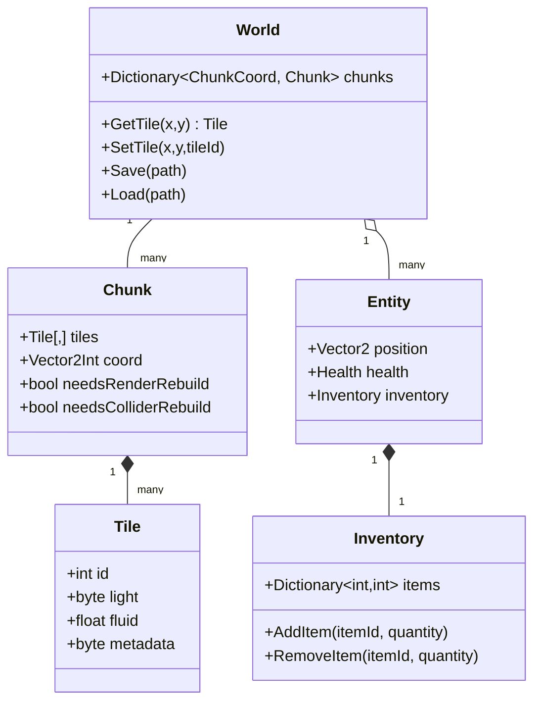

# Unity 2D Sandbox Architecture Plan

## Executive Summary

Unity can support a 2D sandbox game in the style of *Terraria* or *Starbound*, but the project should be designed around chunked world data, chunk-local rendering, and chunk-local or manual physics. The core technical risks are large destructible tilemaps, expensive collider rebuilds, custom lighting, liquid simulation, save-file scale, and multiplayer synchronization.

For a prototype, the recommended focus is a vertical slice: chunked tiles, player movement, basic world generation, block placement/removal, collision, and simple lighting. For a full game, the same architecture can be extended with liquids, advanced lighting, networking, mod support, tooling, and performance test coverage.

## Goals and Scope

The target experience is a 2D side-scrolling sandbox with destructible terrain, biomes, day/night lighting, inventory, enemies, and optional multiplayer. The design supports two milestones:

- **Prototype:** chunked world, tile editing, basic procedural generation, collision, and minimal lighting.
- **Full game:** liquid simulation, richer lighting, enemy pathfinding, save/load, multiplayer, data-driven content, mod support, and editor/debug tools.

## Architecture Overview

World data should be divided into chunks, commonly 16×16 or 32×32 tiles. Each chunk owns tile data and any render or collider representation that can be rebuilt independently. The world manager loads, unloads, saves, and queries chunks around active players.



## Core Data Models

```csharp
public struct Tile
{
    public int id;          // Registry ID for air, dirt, stone, ore, etc.
    public byte light;      // Tile light level, commonly 0-15 or 0-255.
    public float fluid;     // 0.0-1.0 liquid amount.
    public byte metadata;   // Frame, variant, wall, damage, or other compact state.
}
```

```csharp
public sealed class Chunk
{
    public const int Size = 32;
    public Vector2Int Coord { get; }
    public Tile[,] Tiles { get; } = new Tile[Size, Size];
    public bool NeedsRenderRebuild { get; set; }
    public bool NeedsColliderRebuild { get; set; }
}
```

```csharp
public sealed class World
{
    private readonly Dictionary<Vector2Int, Chunk> chunks = new();

    public Tile GetTile(int x, int y)
    {
        Vector2Int chunkCoord = WorldToChunkCoord(x, y);
        if (!chunks.TryGetValue(chunkCoord, out Chunk chunk))
        {
            return default;
        }

        Vector2Int local = WorldToLocalCoord(x, y);
        return chunk.Tiles[local.x, local.y];
    }

    public void SetTile(int x, int y, int tileId)
    {
        Vector2Int chunkCoord = WorldToChunkCoord(x, y);
        Chunk chunk = GetOrCreateChunk(chunkCoord);
        Vector2Int local = WorldToLocalCoord(x, y);
        chunk.Tiles[local.x, local.y].id = tileId;
        chunk.NeedsRenderRebuild = true;
        chunk.NeedsColliderRebuild = true;
    }
}
```

## Chunking Strategy

Use 16×16 or 32×32 chunks for most prototypes. Smaller chunks improve culling and lower the cost of rebuilding one edited region, while larger chunks reduce GameObject and mesh counts. A 32×32 default is a practical starting point.

- Load active chunks around each player and unload distant chunks on a fixed interval.
- Save chunks independently so only dirty chunks need disk writes.
- Store a world seed plus edited chunk diffs when deterministic generation can recreate untouched regions.
- Keep render, collision, lighting, and fluid dirty flags separate so one tile edit does not force every subsystem to rebuild immediately.

## Rendering Options

| Option | Strengths | Risks |
| --- | --- | --- |
| Unity Tilemap | Fast prototype path, built-in palettes, batching, simple layered maps. | Large dynamic edits can be expensive; lighting is not Terraria-style by default. |
| Custom chunk meshes | Full control over culling, vertex colors, shaders, and partial rebuilds. | Requires mesh generation, atlas handling, and update tooling. |
| GPU instancing | Low draw overhead for huge static regions. | More complex data upload and harder dynamic edits. |

Start with Tilemaps if iteration speed matters. Move to custom chunk meshes if lighting, atlas control, or dynamic update performance becomes a bottleneck.

## Collision and Physics

Avoid a single global `CompositeCollider2D` for a huge destructible world. Dynamic edits can force expensive shape recomputation. Prefer one of these approaches:

1. **Chunk-local colliders:** each chunk owns its own `TilemapCollider2D` and optional `CompositeCollider2D` so changes are localized.
2. **Manual tile collision:** entities perform grid/AABB checks against nearby solid tiles. This is often the most predictable solution for platformer movement.
3. **Hybrid:** use Unity physics for entities and projectiles, but use manual tile occupancy checks for terrain movement and digging.

## Lighting

Terraria-like lighting should be a tile lightmap rather than ordinary Unity 2D lights. Store light values per tile and propagate from sunlight and emissive tiles with a breadth-first search.

```csharp
void PropagateLight(int sx, int sy, byte initial)
{
    Queue<Vector2Int> queue = new();
    light[sx, sy] = initial;
    queue.Enqueue(new Vector2Int(sx, sy));

    while (queue.Count > 0)
    {
        Vector2Int current = queue.Dequeue();
        byte currentLight = light[current.x, current.y];
        if (currentLight <= 1)
        {
            continue;
        }

        foreach (Vector2Int direction in directions)
        {
            Vector2Int next = current + direction;
            if (!InBounds(next.x, next.y))
            {
                continue;
            }

            byte attenuation = IsOpaque(next.x, next.y) ? (byte)2 : (byte)1;
            byte nextLight = (byte)Mathf.Max(0, currentLight - attenuation);
            if (nextLight > light[next.x, next.y])
            {
                light[next.x, next.y] = nextLight;
                queue.Enqueue(next);
            }
        }
    }
}
```

Use dirty regions around edited tiles and moving light sources. Render the result through tile vertex colors, Tilemap tinting, or a lightmap texture sampled by a shader.

## Procedural Generation

A robust generator should run multiple passes:

1. Generate surface height with 1D noise.
2. Fill terrain layers such as dirt, stone, cavern, and core.
3. Carve caves with cellular automata, Perlin thresholds, or worm tunnels.
4. Assign biomes by horizontal region, depth, and noise.
5. Scatter ores with blobs, random walks, or depth-weighted noise.
6. Place structures, trees, lakes, dungeons, and biome-specific features.
7. Run validation passes for spawn safety, structure overlap, and important path access.

## Liquids

Use a grid-based cellular automaton. Each liquid cell stores an amount from 0.0 to 1.0. Simulation should update only active liquid cells and their neighbors.

Recommended rule order:

1. Flow downward into empty or partially filled cells.
2. Flow sideways when downward movement is blocked.
3. Flow upward only when pressure exceeds capacity.

Render partial fill height and transparency from the stored amount. Run multiple low-cost simulation iterations when the player is nearby, and pause or approximate distant liquid chunks.

## Pathfinding

Treat the tilemap as a grid graph for simple enemies. Recompute A* paths when tiles change or when an entity's current path becomes invalid. Platformer enemies may need extra node rules for jump height, fall distance, ladders, doors, and one-way platforms.

For larger worlds, maintain navigation data per chunk and mark affected chunks dirty when terrain changes.

## Multiplayer

Use a server-authoritative model:

- Clients send input and tile-edit requests.
- The server validates range, tools, inventory, permissions, and cooldowns.
- The server applies accepted edits to the canonical world state.
- The server broadcasts tile deltas or chunk diffs to subscribed clients.
- Clients predict local movement but reconcile with server state.

Mirror, Unity Netcode for GameObjects, Fish-Net, Photon Fusion, and other libraries can support this pattern, but the game-specific tile diff, chunk subscription, validation, and save logic should remain independent of a particular networking package where possible.

## Saving and Loading

Prefer chunk-based saves with versioned binary data for production. JSON is useful for early debugging but can become too large for full worlds.

Save data should include:

- Format version.
- World seed and generation settings.
- Dirty chunk tile data or edit diffs.
- Entity states.
- Inventories and player progression.
- Time of day and global events.

Use compression for large chunk payloads and keep migration code for older save versions.

## Modding and Content Pipeline

Make content data-driven from the start:

- Use tile, item, entity, biome, and recipe registries keyed by stable string IDs.
- Store gameplay properties in ScriptableObjects, JSON, or another declarative format.
- Load core definitions first and mod definitions second.
- Keep numeric IDs as runtime/generated mappings rather than permanent authoring IDs.
- Consider Addressables or AssetBundles for externally supplied art and prefabs.

## Tooling, Testing, and Profiling

Add debug views early:

- Chunk borders.
- Tile IDs and solidity.
- Light values.
- Liquid amounts and active simulation cells.
- Collider rebuild regions.
- Network chunk subscriptions.

Automated tests should cover coordinate conversion, chunk lookup, tile editing, lighting propagation, fluid flow, save/load round trips, deterministic generation, and network tile-delta serialization.

Use Unity Profiler to track mesh rebuilds, Tilemap updates, collider rebuilds, Physics2D, allocations, and draw calls.

## Roadmap

| Phase | Duration | Goals |
| --- | --- | --- |
| Prototype | 4-8 weeks | Chunked tiles, player movement, world generation, basic editing, collision. |
| Core Systems Alpha | 12-20 weeks | Biomes, caves, lighting, inventory, enemies, save/load, basic liquids. |
| Networking Alpha | 6-10 weeks | Server-authoritative movement and tile edits, local/LAN testing, chunk sync. |
| Feature Complete | 12-16 weeks | Content, crafting, UI, mod pipeline, optimization, multiplayer polish. |
| Beta/Release Candidate | 8-12 weeks | QA, profiling, platform testing, save migrations, launch polish. |

## Implementation Priorities

1. Build a deterministic chunk coordinate system and tests.
2. Add chunk-local render rebuilds.
3. Implement manual tile collision for a basic controller.
4. Add tile edit events and dirty subsystem flags.
5. Add simple generator and save/load.
6. Add lighting and liquid systems after the world pipeline is stable.
7. Add multiplayer only after single-player tile edits, persistence, and validation rules are clear.
