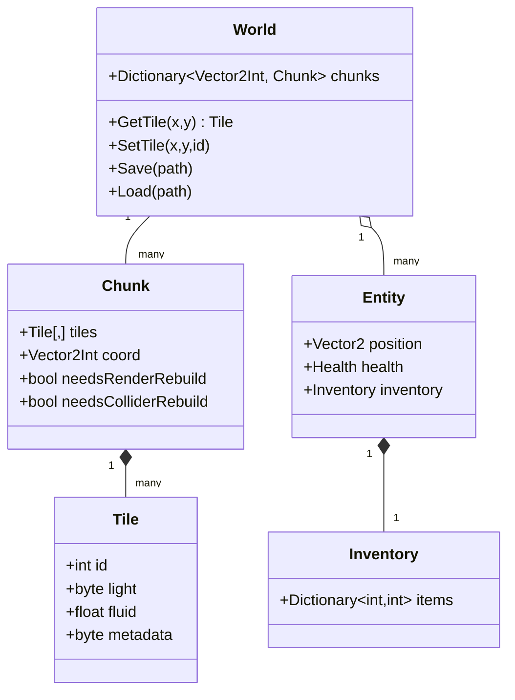

# 01 — Architecture

> **Status:** Planning.
> **Decisions:** Chunked world; `World` orchestrates `Chunk`s; entities query the grid.
> **Invariants:** Chunk-local rebuilds; separate dirty flags; engine-agnostic seams.

## System decomposition

```
World (orchestrator)
 ├─ ChunkStore            owns Chunk lifecycle (load/unload/save), keyed by Vector2Int
 │   └─ Chunk             owns Tile[,], dirty flags, and per-chunk views
 │        ├─ RenderView   Tilemap or mesh for this chunk            → 04-rendering
 │        ├─ ColliderView per-chunk collider (or none)              → 05-collision-physics
 │        ├─ LightLayer   light values for this chunk               → 06-lighting
 │        └─ FluidLayer   fluid amounts + active set                → 08-liquids
 ├─ Generator             deterministic multi-pass world gen        → 07-procedural-generation
 ├─ LightingSystem        BFS propagation over dirty regions        → 06-lighting
 ├─ FluidSystem           cellular automaton over active cells      → 08-liquids
 ├─ EntitySystem          players, NPCs, projectiles                → 02-data-models
 │   └─ Pathfinder        grid A* with dynamic updates              → 09-pathfinding
 ├─ SaveSystem            chunk diffs + versioned serialization     → 11-saving-loading
 ├─ NetworkLayer          server-authoritative tile deltas          → 10-multiplayer
 └─ ContentRegistry       tiles/items/biomes/recipes by string ID   → 12-modding
```

The dependency arrow points **toward data**: subsystems read/write `World`/`Chunk` state and
react to dirty flags. They do not call each other directly where it can be avoided; this keeps
each one testable and swappable.

## Ownership rules

- **`World`** is the only object that creates/destroys `Chunk`s and resolves world↔chunk↔local
  coordinates. Everything else goes through `World.GetTile`/`SetTile`.
- **`Chunk`** owns its tile array and its per-chunk views. A chunk never reaches into a neighbor's
  array directly; cross-chunk reads go through `World`.
- **Systems** (lighting, fluids, save, network) are stateless w.r.t. world data — their state is
  scheduling/queues. The source of truth is always the chunk arrays.

## Data flow: a tile edit

This is the canonical path every gameplay action funnels through.

```
input/AI/network → World.SetTile(x, y, id)
   → resolve chunk + local coords
   → write Chunk.Tiles[lx, ly]
   → set Chunk.NeedsRenderRebuild = true
   → set Chunk.NeedsColliderRebuild = true
   → enqueue lighting dirty region around (x, y)
   → enqueue fluid wake for (x, y) and neighbors
   → mark chunk dirty for save
   → (multiplayer) emit tile delta to NetworkLayer
```

Each consumer drains its work later, on its own budget:

- RenderView rebuilds the chunk mesh/Tilemap next frame it's visible.
- ColliderView rebuilds only that chunk's collider.
- LightingSystem re-propagates only the affected region.
- FluidSystem re-activates the touched cells.
- SaveSystem persists the dirty chunk on the next save tick.

> **Why funnel through `SetTile`?** A single choke point guarantees no edit can bypass dirty-flag
> bookkeeping. Bugs where "the tile changed but the light/collider didn't" come from edits that
> skip this path. Don't add side doors.

## Class relationships



## Threading / scheduling notes

- World data lives on the main thread (Unity API constraints for Tilemap/colliders).
- Pure-data work (generation, lighting BFS, fluid CA, serialization) is a candidate for
  Jobs/Burst or background threads **operating on copies or non-Unity arrays**, then applying
  results on the main thread. Defer this until profiling shows the need (see [13](13-tooling-testing.md)).
- Budget per-frame work: cap chunk rebuilds, light updates, and fluid iterations per frame so a
  burst of edits never stalls a frame.

## See also

- [Data Models](02-data-models.md) — the concrete types referenced above.
- [Chunking](03-chunking.md) — lifecycle and dirty-flag mechanics.
- [Roadmap](14-roadmap.md) — the order to build these systems.
