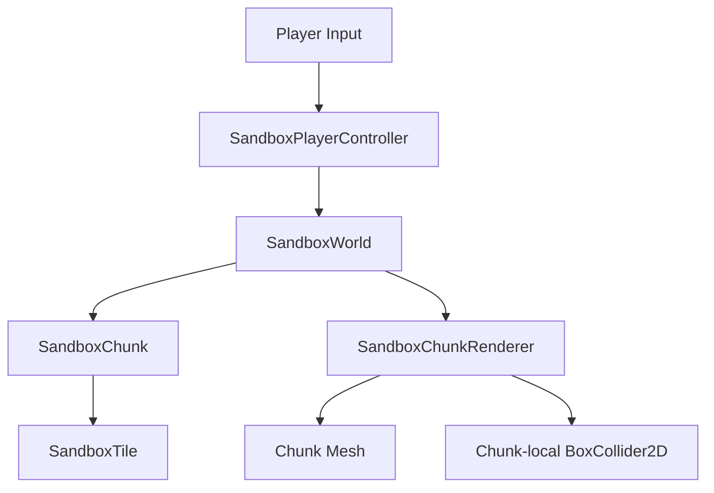

# Architecture Map

## Runtime Layers

## Responsibility Boundaries

| Area | Current owner | Responsibility |
| --- | --- | --- |
| World queries and edits | `SandboxWorld` | Convert world coordinates, load chunks, generate missing chunks, apply tile edits. |
| Chunk storage | `SandboxChunk` | Own a 32×32 tile array and dirty flags. |
| Tile state | `SandboxTile` | Store compact per-tile data: id, light, fluid, metadata. |
| Rendering/collision | `SandboxChunkRenderer` | Build visible tile quads and local collision shapes from chunk data. |
| Player controls | `SandboxPlayerController` | Move, jump, and request valid tile edits. |

## Editing Guidance

- Keep gameplay code aligned with the design document's chunk-first architecture.
- Prefer small, explicit data structures over hidden scene state.
- Do not add demo-only systems unless they directly prove a sandbox milestone.
- Keep render, collider, lighting, and save dirty states separable as the project grows.
