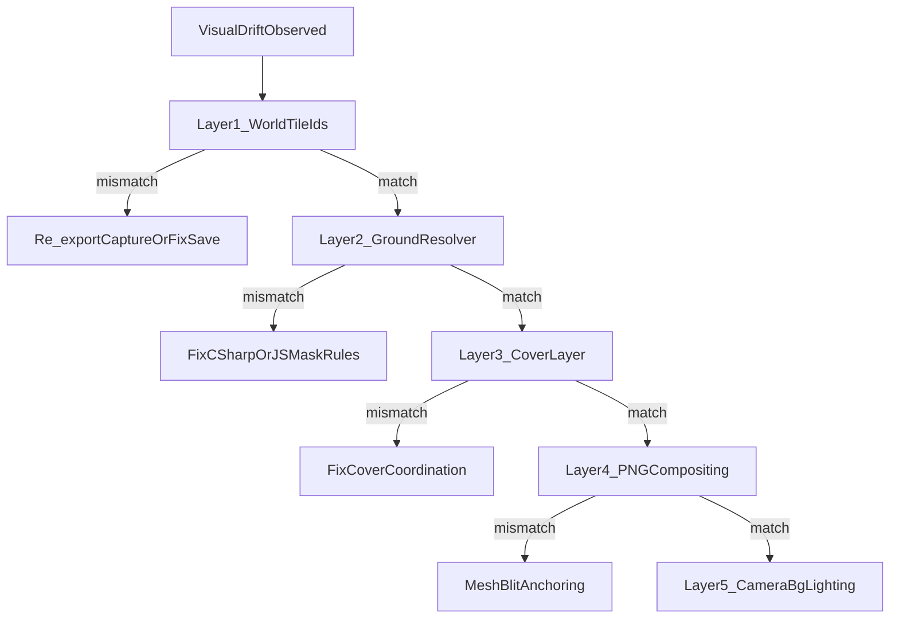

# Autotile Drift RCA Playbook

Use this playbook when Play Mode terrain looks wrong compared to an offline tile-viz render or resolver report. **Do not change resolver rules until you know which layer failed.**

Snippet render goldens live under `tools/tile-viz/test/fixtures/render/` (see `render.test.js`). For ad-hoc renders use `scripts/render-all.sh` or `node src/cli.js render`.

## Decision tree



## Layer 1 — World tile ids

Live save export (committed regression snapshot): `tools/tile-viz/test/fixtures/captures/sandbox-world-live.json`

```bash
cd tools/tile-viz
node scripts/diff-tile-space.mjs \
  test/fixtures/captures/sandbox-world-live.json \
  path/to/play-mode-export.json
```

**Play Mode export (MCP, while game running):**

```
world_export_tile_space xMin=-160 yMin=0 xMax=-65 yMax=31 writeFile=true
```

Then diff the exported file against `sandbox-world-live.json`. Non-zero diff count means **world data drift** — refresh the live snapshot or compare against the export you just took.

## Layer 2 — Ground resolver ids

Play Mode precomputed baseline (2642 solid cells in the default mountain region):

`Assets/StreamingAssets/AutotileBaselines/sandbox-scene-mountain-autotile.json`

Regenerate from a Play Mode export after resolver contract changes:

```bash
node scripts/export-autotile-baseline.mjs path/to/play-mode-export.json
```

Offline compare (tile-viz report vs exported baseline JSON):

```bash
node scripts/compare-autotile-baseline.mjs \
  ../../Assets/StreamingAssets/AutotileBaselines/sandbox-scene-mountain-autotile.json \
  path/to/play-mode-export.json \
  --only ground --max-diffs 20
```

**Play Mode MCP:**

```
autotile_diff_baseline xMin=-160 yMin=0 xMax=-65 yMax=31 baselineName=sandbox-scene-mountain maxDiffs=50
```

Per-cell debug (offline):

```bash
node scripts/log-autotile-debug-cells.mjs test/fixtures/snippets/dirt-window-inner-edges.json --compact -114 29 -111 28
```

**F3:** `GroundCoverSplit` for ground + cover sprite ids (bottom / top half).

**F3 overlay:** cycle to `ResolveDetail` for per-cell ground sprite id, flip notch, compact mask (`011/011/000` layout), and green/red baseline match tint. Use `CoordinateLabel` to read world tile coordinates when correlating MCP `tile_at` or baseline coords. F3 logs mode name and index to the Console.

**Atlas layout:** when ids and masks match offline but pixels look rotated or inverted, run **ProjectTwelve → Visual → Validate Ground Autotile Sheets** in the Editor. Failures indicate TextureImporter slice order drift in `Assets/_Licensed/` — fix slices per [ground-autotile-32-rules.md](ground-autotile-32-rules.md); do not compensate in rule tables.

**MCP `tile_autotile`:** returns full `groundMask` (3×3), `groundSpriteId`, and `flipX`. Compact mask string: `mask[wx,ny]/mask[wx,cy]/mask[wx,sy]` for north/center/south rows (west→east).

## Layer 3 — Cover layer

Compare cover fields:

```bash
node scripts/compare-autotile-baseline.mjs \
  ../../Assets/StreamingAssets/AutotileBaselines/sandbox-scene-mountain-autotile.json \
  path/to/play-mode-export.json \
  --only cover --coords -102,30 -87,29
```

## Layer 4 — PNG compositing

Render a snippet or exported space (requires licensed assets):

```bash
node scripts/render-capture.mjs \
  test/fixtures/snippets/mountain-window-corner.json \
  --png out/mountain-window-corner.png --scale 16 --flat-light
```

Golden tests: `test/fixtures/render/*.png` (`npm test`, skipped without assets).

Pixel diff vs Unity screenshot (match scale/crop and flat lighting):

```bash
node scripts/diff-png.mjs test/fixtures/render/grass-cover-middle.png path/to/unity-capture.png --out out/diff.png
```

Isolation matrix:

| tile-viz | Unity |
|----------|-------|
| default render | normal Play Mode |
| `--no-cover` | F3 ground-only modes |
| `--no-extrude` | check bleed vs wrong sprite |

If ids match but pixels differ → see [VISUAL_BEHAVIOR_SPEC.md](../VISUAL_BEHAVIOR_SPEC.md) §11 mesh compositing gate (`AppendFixedCellQuad`). If tile-viz `--no-cover` PNG matches Unity after that fix but both look wrong, validate atlas slices next.

## Visual override evidence attachments

When a cell-level visual override helps explain a drift report, attach the override file beside the tile-space capture and screenshot/diff artifacts. Use the `*.visual-overrides.json` suffix so the file is clearly diagnostic evidence rather than canonical world data.

Recommended bundle for an agent diagnosis:

1. The tile-space capture (`*.json`) exported from Play Mode or a reduced snippet.
2. The visual override annotation (`*.visual-overrides.json`) that marks or substitutes the suspect cells.
3. A rendered PNG produced with the override and, when possible, a baseline PNG without the override.
4. The relevant per-cell debug report from `log-autotile-debug-cells.mjs` or runtime MCP `tile_autotile`.

Example capture flow:

```bash
cd tools/tile-viz
node scripts/log-autotile-debug-cells.mjs test/fixtures/snippets/dirt-window-inner-edges.json --compact -114 29 -111 28
node src/cli.js visual-overrides list --file out/mountain-window-corner.visual-overrides.json
node src/cli.js visual-overrides inspect --file out/mountain-window-corner.visual-overrides.json --coords -104,26
node scripts/render-capture.mjs test/fixtures/snippets/mountain-window-corner.json \
  --visual-overrides out/mountain-window-corner.visual-overrides.json \
  --png out/mountain-window-corner.override.png --scale 16 --flat-light
```

The override file should describe only the cells under diagnosis and should not be copied into save files, generated captures, or resolver fixtures unless a test explicitly covers debug-mode behavior. If the override demonstrates the intended look, convert that finding into a normal resolver, catalog, or mesh-compositing fix and re-run the appropriate parity checks.

## When to re-freeze captures

| File | When to update |
|------|----------------|
| `sandbox-world-live.json` | After exporting current save for regression snippets |
| `Assets/StreamingAssets/AutotileBaselines/sandbox-scene-mountain-autotile.json` | After Play Mode export or resolver/mask changes |
| `test/fixtures/render/*.png` | After intentional visual contract change (with assets present) |

## See also

- [VISUAL_BEHAVIOR_SPEC.md](../VISUAL_BEHAVIOR_SPEC.md) — autotile contract
- [tools/tile-viz/README.md](../../tools/tile-viz/README.md) — script reference
- [AGENTS.md](../../AGENTS.md) — MCP tool inventory
