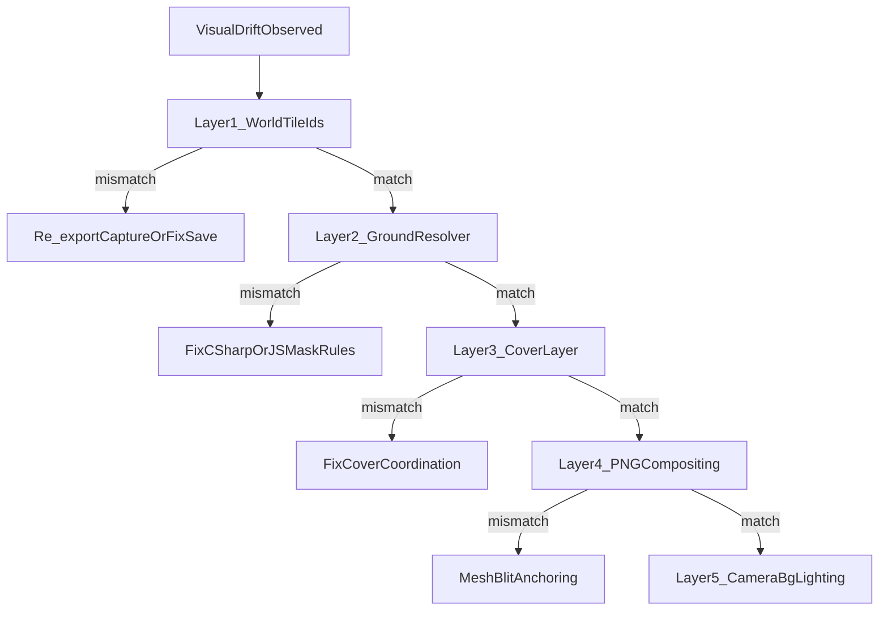

# Autotile Drift RCA Playbook

Use this playbook when Play Mode terrain looks wrong compared to the offline reference
[`tools/tile-viz/out-slope/sandbox-scene-mountain.png`](../../tools/tile-viz/out-slope/sandbox-scene-mountain.png)
or any tile-viz render. **Do not change resolver rules until you know which layer failed.**

## Decision tree



## Layer 1 — World tile ids

Frozen mountain capture: `tools/tile-viz/test/fixtures/captures/sandbox-scene-mountain.json`  
Live save export: `tools/tile-viz/test/fixtures/captures/sandbox-world-live.json`

```bash
cd tools/tile-viz
node scripts/diff-tile-space.mjs \
  test/fixtures/captures/sandbox-scene-mountain.json \
  test/fixtures/captures/sandbox-world-live.json
```

**Play Mode export (MCP, while game running):**

```
world_export_tile_space xMin=-160 yMin=0 xMax=-65 yMax=31 writeFile=true
```

Then diff the exported file against the frozen capture. Non-zero diff count means **world data drift** — refresh the capture or stop comparing live Play Mode to the frozen PNG.

## Layer 2 — Ground resolver ids

Precomputed baseline (2642 solid cells):

`tools/tile-viz/test/fixtures/baselines/sandbox-scene-mountain-autotile.json`

Regenerate after capture or resolver contract changes:

```bash
node scripts/export-autotile-baseline.mjs test/fixtures/captures/sandbox-scene-mountain.json
```

Offline compare (tile-viz report vs baseline):

```bash
node scripts/compare-autotile-baseline.mjs \
  test/fixtures/baselines/sandbox-scene-mountain-autotile.json \
  test/fixtures/captures/sandbox-scene-mountain.json \
  --only ground --max-diffs 20
```

**Play Mode MCP:**

```
autotile_diff_baseline xMin=-160 yMin=0 xMax=-65 yMax=31 baselineName=sandbox-scene-mountain maxDiffs=50
```

Per-cell debug (offline):

```bash
node scripts/log-autotile-debug-cells.mjs test/fixtures/snippets/dirt-window-inner-edges.json --compact -114 29 -111 28
```

**F3 overlay:** cycle to `MismatchBaseline` — red cells are ground sprite/flip mismatches vs baseline (when world tile ids match).

## Layer 3 — Cover layer

Compare cover fields:

```bash
node scripts/compare-autotile-baseline.mjs \
  test/fixtures/baselines/sandbox-scene-mountain-autotile.json \
  test/fixtures/captures/sandbox-scene-mountain.json \
  --only cover --coords -102,30 -87,29
```

**F3:** `CoverSpriteIdLabel` or `GroundCoverSplit` (ground bottom, cover top half).

## Layer 4 — PNG compositing

Render reference (requires licensed assets):

```bash
node scripts/render-capture.mjs \
  test/fixtures/captures/sandbox-scene-mountain.json \
  --png out-slope/sandbox-scene-mountain.png --scale 32 --flat-light
```

Golden test: `test/fixtures/render/sandbox-scene-mountain.png` (npm test, skipped without assets).

Pixel diff vs Unity screenshot (same scale/crop: 32 px/tile, flat lighting, no UI):

```bash
node scripts/diff-png.mjs test/fixtures/render/sandbox-scene-mountain.png path/to/unity-capture.png --out out-slope/diff.png
```

Isolation matrix:

| tile-viz | Unity |
|----------|-------|
| default render | normal Play Mode |
| `--no-cover` | F3 ground-only modes |
| `--no-extrude` | check bleed vs wrong sprite |

If ids match but pixels differ → see [VISUAL_BEHAVIOR_SPEC.md](../VISUAL_BEHAVIOR_SPEC.md) §11 mesh compositing gate (`AppendFixedCellQuad`).

## Visual override evidence attachments

When a cell-level visual override helps explain a drift report, attach the override file beside the tile-space capture and screenshot/diff artifacts. Use the `*.visual-overrides.json` suffix so the file is clearly diagnostic evidence rather than canonical world data.

Recommended bundle for an agent diagnosis:

1. The tile-space capture (`*.json`) exported from Play Mode or a reduced snippet.
2. The visual override annotation (`*.visual-overrides.json`) that marks or substitutes the suspect cells.
3. A rendered PNG produced with the override and, when possible, a baseline PNG without the override.
4. The relevant per-cell debug report from `log-autotile-debug-cells.mjs` or runtime MCP `tile_autotile`.

Example capture flow:

```bash
cd tools/tile-viz
node scripts/log-autotile-debug-cells.mjs test/fixtures/captures/sandbox-scene-mountain.json --compact -114 29 -111 28
node src/cli.js visual-overrides list --file out/sandbox-scene-mountain.visual-overrides.json
node src/cli.js visual-overrides inspect --file out/sandbox-scene-mountain.visual-overrides.json --coords -114,29
node scripts/render-capture.mjs test/fixtures/captures/sandbox-scene-mountain.json \
  --visual-overrides out/sandbox-scene-mountain.visual-overrides.json \
  --png out/sandbox-scene-mountain.override.png --scale 32 --flat-light
```

The override file should describe only the cells under diagnosis and should not be copied into save files, generated captures, or resolver fixtures unless a test explicitly covers debug-mode behavior. If the override demonstrates the intended look, convert that finding into a normal resolver, catalog, or mesh-compositing fix and re-run the appropriate parity checks.

## When to re-freeze captures

| File | When to update |
|------|----------------|
| `sandbox-scene-mountain.json` | Intentional change to the mountain test scene layout |
| `sandbox-world-live.json` | After exporting current save for regression snippets |
| `sandbox-scene-mountain-autotile.json` | After capture or resolver/mask changes |
| `test/fixtures/render/sandbox-scene-mountain.png` | After intentional visual contract change (with assets present) |

## See also

- [VISUAL_BEHAVIOR_SPEC.md](../VISUAL_BEHAVIOR_SPEC.md) — autotile contract
- [tools/tile-viz/README.md](../../tools/tile-viz/README.md) — script reference
- [AGENTS.md](../../AGENTS.md) — MCP tool inventory
