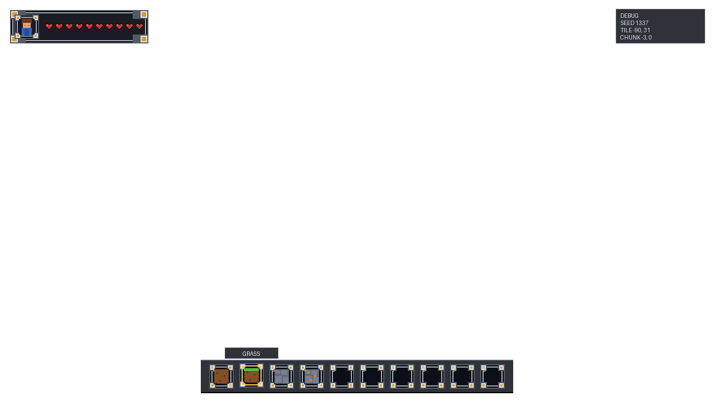
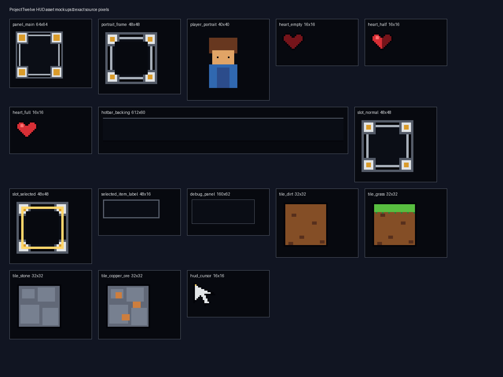
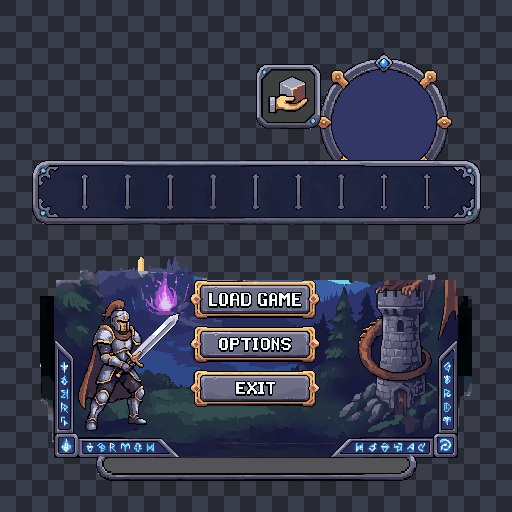
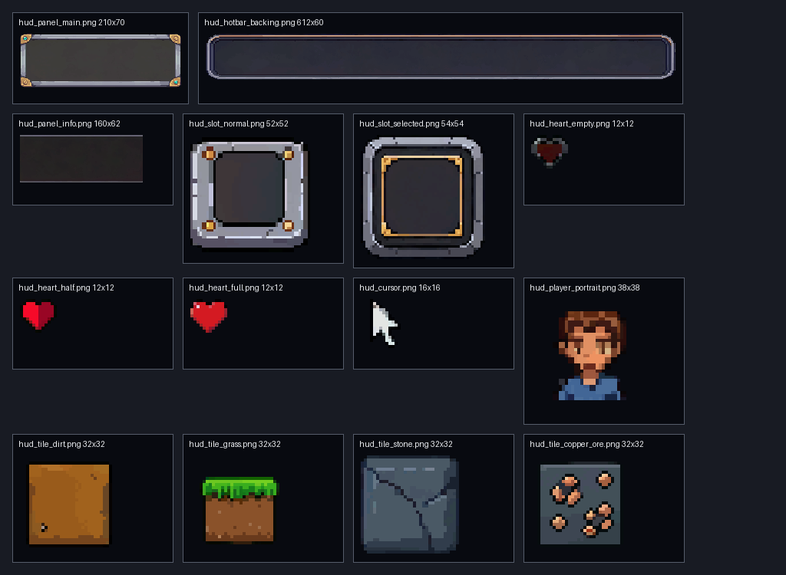
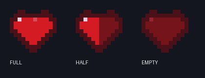

# HUD asset manifest

The authoritative machine-readable contract is [`specs/hud-assets.json`](../specs/hud-assets.json). It resolves the consolidated prompt in favor of the final health-frame override: the vitals panel is one row (`portrait + ten hearts`), numeric health is omitted, and no hotbar rails are present.



## Global contract

| Property | Required value |
|---|---|
| Bitmap format | PNG, RGBA, 8 bits per channel |
| Unity sprite mode | Single |
| Pixels per unit | 100 |
| Filter | Point |
| Compression | None |
| Mipmaps | Disabled |
| Wrap mode | Clamp |
| Mesh | Full Rect |
| Reference canvas | 1280×720 |
| Canvas scaling | Scale With Screen Size, Match Width Or Height, match 0.5 |
| Pixel-perfect | Enabled |
| Asset scale at reference resolution | 1:1 source pixel to UI pixel |
| Positioning | Integer sizes and anchored positions only |

The world art uses 16 PPU, while the HUD uses the Canvas reference PPU of 100. Consistency is achieved through a chunky 2 px drawing module and Point filtering—not by changing the Canvas scale or stretching individual sprites. The Canvas may scale uniformly for other display resolutions.

## Required assets (v3)

Contract v3 is **9-slice-first**: sliced panels ship as small sliceable bitmaps (source) and take
their on-screen size from the RectTransform (display); only Simple sprites require exact bitmaps.
Full rationale: [`hud-redesign-pixellab.md`](hud-redesign-pixellab.md).

| Asset | File | Source → display | Unity treatment | Purpose |
|---|---|---:|---|---|
| Vitals/main panel | `hud_panel_main.png` | 64×64 → 252×64 | Sliced, borders 16/16/16/16 | One-row vitals shell; ornaments fully contained in corners |
| Portrait frame | `hud_portrait_frame.png` | 48×48 → 48×48 | Sliced, borders 12/12/12/12 | Slot-family square portrait surround (same crop as normal slot) |
| Player portrait | `hud_player_portrait.png` | 40×40 | Simple | Player identity inside portrait frame |
| Empty heart | `hud_heart_empty.png` | 16×16 | Derived from full-heart master | Missing ten health |
| Half heart | `hud_heart_half.png` | 16×16 | Derived from full-heart master | Partial health fill |
| Full heart | `hud_heart_full.png` | 16×16 | Simple | Ten health; master silhouette for all states |
| Hotbar backing | `hud_hotbar_backing.png` | 612×60 → 560×60 | Sliced, borders 6/6/6/6 | Retained v2 backing; slicing narrows it to the v3 display width |
| Normal slot | `hud_slot_normal.png` | 48×48 | Sliced, borders 12/12/12/12 | Ten numbered creative slots |
| Selected overlay | `hud_slot_selected.png` | 48×48 | Sliced, borders 12/12/12/12; transparent punched center | Gold selected state over the active slot |
| Item label | `hud_selected_item_label.png` | 48×16 → 96×20 | Sliced, borders 6/6/6/6 | Temporary backed label above active slot |
| Debug panel | `hud_panel_info.png` | 160×62 | Sliced, borders 2/2/2/2 | Plain disposable telemetry backing (retained v2 asset) |
| Dirt icon | `hud_tile_dirt.png` | 32×32 | Simple | Slot 1 content |
| Grass icon | `hud_tile_grass.png` | 32×32 | Simple | Slot 2 content |
| Stone icon | `hud_tile_stone.png` | 32×32 | Simple | Slot 3 content |
| Bricks fallback icon | `hud_tile_bricks.png` | 32×32 | Simple | Slot 4 fallback; live slots resolve vendor ground sprites |
| Cursor | `hud_cursor.png` | 16×16 | Simple | Optional HUD pointer with top-left hotspot |

Every asset has a structured generation prompt in the JSON file. Those prompts are suitable for an image model, but generated results must still be resized or rejected to match the exact dimensions and alpha contract before Unity import.

## Layout measurements (v3)

- Vitals: 252×64 at `(16, 16)`, top-left. Portrait frame is 48×48 at local `(8, 8)`; portrait is 40×40; hearts begin at local `(64, 24)` with ten 16×16 sprites and 2 px gaps.
- Hotbar: 560×60 at bottom-center `(360, 646)`. Ten 48×48 slots begin at local `(13, 6)` with a 54 px stride. Item icons are 32×32. Selection is a same-size 48×48 overlay and lifts the active slot 2 px.
- Selected-item label: 96×20, centered 6 px above the active slot, visible for 1.75 seconds.
- Debug panel: 160×62 at `(1104, 16)`, top-right, with 8 px horizontal and 6 px vertical padding.

## Deterministic mockup generation

Install Pillow in the active Python environment, then run:

```powershell
python scripts/generate_hud_mockups.py
```

The script validates the 1:1 scale contract, renders each asset without antialiasing, and writes the individual PNGs plus:

- [`images/hud-mockups/hud-overlay-1280x720.png`](../images/hud-mockups/hud-overlay-1280x720.png) — transparent reference-resolution layout overlay.
- [`images/hud-mockups/hud-asset-contact-sheet.png`](../images/hud-mockups/hud-asset-contact-sheet.png) — source-pixel review sheet.



The generated files are mockups and specification fixtures. Production sprites remain under `Assets/Sprites/UI/Generated/` and should only be replaced after visual approval and Unity import verification.

## PixelLab generation record

PixelLab UI asset `f7b8c244-a1ce-4a86-9f11-fc9728e90cba` was generated on seed 1337 at 512×512. The job consumed the available 40 trial generations and completed successfully, but the visual result is **rejected for production integration**.



The result is a coherent fantasy menu illustration, but it violates the HUD specification: it includes baked `LOAD GAME`, `OPTIONS`, and `EXIT` text, a character and environment scene, and no complete set of isolated hearts, slots, label, or debug assets. It cannot be losslessly cropped into the required exact bitmaps. The original transparent PNG is preserved at [`images/hud-mockups/pixellab-hud-component-sheet-v1-rejected.png`](../images/hud-mockups/pixellab-hud-component-sheet-v1-rejected.png) for provenance only; `integration_allowed` remains false in the JSON contract.

## Individual PixelLab retry and production wiring

The HUD was retried as one PixelLab job per element. Accepted candidates were normalized by [`../scripts/normalize_pixellab_hud_assets.py`](../../scripts/normalize_pixellab_hud_assets.py) and wired into `SandboxHUD.prefab` plus `SandboxHudPrefabBuilder`.



Accepted and wired:

- Health frame: 210×70, 14 px slice borders.
- Hotbar backing: 612×60, 6 px slice borders.
- Debug backing: 160×62, 2 px slice borders.
- Normal and selected slots: 52×52 and 54×54, 8 px slice borders.
- Full heart: 12×12 accepted PixelLab master; half and empty states are derived from its exact alpha mask and perimeter treatment.
- HUD portrait: 38×38; disconnected generation artifacts removed deterministically.
- Dirt, grass, stone, and copper icons: 32×32.
- Cursor: 16×16, retained as an optional generated asset.

The unified heart-state review confirms that all three states now share one silhouette, outline weight, and pixel grid:



The PixelLab portrait-frame job was rejected because it generated a full component kit. The selected-item label job was rejected because it introduced a checker texture. The existing production portrait frame and code-backed label remained in use until v3.

## v3 hero-sheet generation record

Contract v3 regenerated the panel family from **one `pieces`-templated `create_ui_asset` job**
(asset `c71619ee-82db-402a-b32f-b3bcb2ece6e8`, seed 1337, 512×512, 40 generations). The four
template shapes came back exactly at their author-placed coordinates and were cropped and
÷4-downscaled deterministically by `--v3-sheet` in
[`normalize_pixellab_hud_assets.py`](../../scripts/normalize_pixellab_hud_assets.py):

- `panel_main` 64×64 — baked scenery/text in the fill was repaired deterministically
  (clean top-left quadrant mirrored 4-way, interior flood-filled with the spec panel color).
- `slot_normal` 48×48 — accepted as-is; also reused as the portrait frame.
- `slot_selected` 48×48 — interior alpha punched out so the gold overlay shows the item icon.
- `label_bar` 48×16 — accepted as-is; first production `hud_selected_item_label.png`.

Draft crops and the composed review overlay live under
[`../images/hud-mockups/pixellab-v3/`](../images/hud-mockups/pixellab-v3/hud-overlay-draft.png).
Hearts (16×16 master), tile icons, and the 40×40 portrait come from `create_1_direction_object`
candidate packs promoted after user review and normalized by `--v3-objects`.
