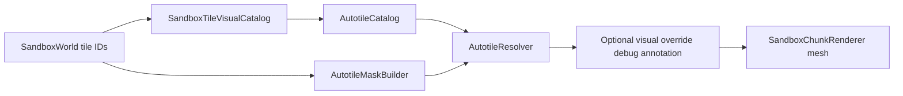
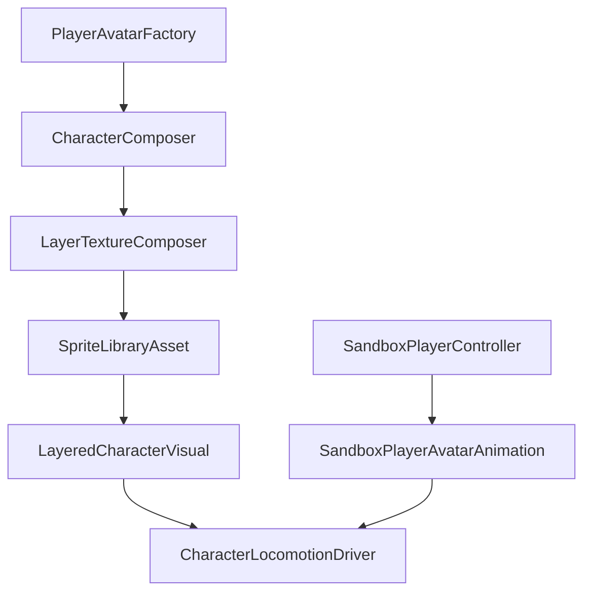

# Visual integration

> **Status:** Terrain autotiling and player avatar presentation use project-owned code under `Assets/Scripts/Visual/`.
> **Decisions:** Sandbox simulation owns tile IDs; visuals resolve at render/compose time only.
> **Invariants:** World state stores tile IDs; `SandboxTileVisualCatalog` maps IDs to autotile tileset names.

## Overview

| System | ProjectTwelve touchpoints |
|--------|-------------------------|
| Terrain autotiles | `AutotileCatalog`, `AutotileResolver`, `AutotileMaskBuilder`, `SandboxTileVisualCatalog`, `SandboxChunkRenderer` |
| Player avatar | `CharacterComposer`, `LayeredCharacterVisual`, `CharacterLocomotionDriver`, `PlayerAvatarFactory`, `SandboxPlayerAvatarVisual` |
| Creatures | `MonsterVisualCatalog`, `MonsterLocomotionDriver`, `MonsterSpawnHelper`, `MountCompositor` |
| Sprite effects | `EffectCatalog`, `SpriteEffectInstance` |

Licensed source art lives in the private **project-twelve-assets** git submodule at `Assets/_Licensed/`. Import paths: `Assets/_Licensed/config/visual-import.txt` (optional override: gitignored `config/visual-import.local-only.txt`).

## Licensed asset inventory

| Audience | Document |
|----------|----------|
| Public (contracts + pointers) | [Licensed assets reference](licensed-assets-reference.md) |
| Submodule maintainers | [`Assets/_Licensed/docs/README.md`](../../Assets/_Licensed/docs/README.md) |
| Vendor script API + catalogs | [`Assets/_Licensed/docs/vendor/README.md`](../../Assets/_Licensed/docs/vendor/README.md) |
| Catalog regen + runtime wiring | [`Assets/_Licensed/docs/integration/README.md`](../../Assets/_Licensed/docs/integration/README.md) |

Do not copy full equipment/prop name tables from the submodule into the public repo.

## Vendor parity (Pixel Heroes Hub)

ProjectTwelve does **not** reference vendor demo scripts at runtime. Behavioral contracts are documented in [Visual behavior spec](../VISUAL_BEHAVIOR_SPEC.md) and aligned with the public [Pixel Heroes Hub wiki](https://github.com/hippogamesunity/PixelHeroesHub/wiki).

| Vendor concept | ProjectTwelve replacement | Status |
|----------------|---------------------------|--------|
| CharacterBuilder (runtime layer merge) | `CharacterComposer.Rebuild()` | Implemented |
| SpriteLibrary / SpriteLibraryAsset | Runtime `SpriteLibraryAsset` from merged texture | Implemented |
| CharacterAnimation (clip API) | `CharacterLocomotionDriver` + prefab `Animator` | Partial — sandbox uses Idle/Run/Jump/Fall/Land only |
| CharacterControls | Stripped; `SandboxPlayerController` owns physics | By design |
| Detached firearms | `FirearmVisual` + `ApplyFirearm()` | Partial — not wired from `PlayerAvatarFactory` |
| Sprite effects (dust, muzzle) | `EffectCatalog.CreateSpriteEffect` | Partial — driver hooks exist; scene catalog optional |
| Sprite sheet format (576×928, 64×64 cells) | `CharacterSheetLayout` | Implemented |
| Building characters at runtime | Equipment strings on `CharacterComposer` + `Rebuild()` | Implemented |

### P1 non-goals (recorded per P1-VISUAL-001)

The P1 avatar slice deliberately stops at the five locomotion states wired by
`SandboxPlayerAvatarAnimation` (Idle, Run, Jump, Fall, Land). Deferred to
[P2-VISUAL-002](tickets/p2-visual-002-specify-extended-character-presentation.md):

- Combat triggers (`Slash`, `Jab`, `Push`, `Shot`, `Hit`) — no combat simulation exists yet.
- Detached firearm presentation (`FirearmVisual`, muzzle socket) — not wired from `PlayerAvatarFactory`.
- Walk vs Run speed threshold — sandbox controller has a single move speed; `Walk` stays unused.

## Implementation status matrix

| Capability | Status | Notes |
|------------|--------|-------|
| Autotiled terrain in chunk meshes | Implemented | P1-RENDER-001 |
| Random avatar spawn in play mode | Implemented | Requires submodule + catalog |
| Foot alignment to collider | Implemented | `SandboxPlayerAvatarVisual` |
| Locomotion from controller velocity | Partial | 5 of 12+ animator states wired |
| Walk vs Run threshold | Deferred | P2-VISUAL-002 |
| Combat triggers (Slash, Shot, etc.) | Deferred | Until combat simulation exists |
| Detached firearm + muzzle socket | Deferred | P2-VISUAL-002 |
| Run/Jump/Land dust VFX | Deferred | Needs `EffectCatalog` in scene |
| Horns layer in merge order | Deferred | Spec lists Horns; merge omits it |
| Monster spawn + locomotion demo | Partial | `MonsterSpawnHelper` works; no AI wiring |
| EditMode visual invariant tests | Implemented | P1-VISUAL-002 — sheet layout, merge order, autotile pick/flip |
| Catalog import pipeline spec | Open | P2-VISUAL-001 |

## Data flow (terrain)

Terrain rendering is a three-stage presentation pipeline:

1. **Normal autotile resolve** — world tile IDs plus the visual catalog build masks and resolve ground/cover sprite IDs and flip flags.
2. **Optional visual override** — debug-only annotations may replace the emitted visual for selected cells after resolution, without mutating world state or resolver inputs.
3. **Mesh emission** — `SandboxChunkRenderer` emits fixed-cell quads from the final presentation decision.

Because overrides sit between resolve and mesh emission, they are useful for isolating renderer/compositor hypotheses while preserving the underlying tile IDs, collision, lighting, nav, and generation contract.

## Data flow (player avatar)

1. `PlayerAvatarFactory` instantiates the licensed character prefab, strips vendor demo scripts, and attaches project-owned components.
2. `CharacterComposer` merges equipment layer textures into a 576×928 sheet and builds a runtime `SpriteLibraryAsset`.
3. `LayeredCharacterVisual.ApplySpriteLibrary` assigns the library to the body `SpriteLibrary` component.
4. `SandboxPlayerAvatarAnimation` reads `SandboxPlayerController` velocity and calls `ISandboxPlayerLocomotion` methods on `CharacterLocomotionDriver`.

## Monster spawn and locomotion

Monster visuals use a catalog-driven spawn API:

1. `MonsterVisualCatalog` maps string IDs (e.g., `"PurpleBat"`) to local monster prefabs.
2. `MonsterSpawnHelper.Spawn(catalog, id, position)` instantiates the prefab and ensures `MonsterVisual` and `MonsterLocomotionDriver` are attached.
3. `MonsterLocomotionDriver` wraps the underlying animator with explicit state methods:
   - Bool parameters (exclusive): `Idle`, `Ready`, `Walk`, `Run`, `Jump`, `Die`.
   - Triggers: `Attack`, `Hit`, `Fire`.
   - **Note:** `driver.Run()` maps to `Walk=true` in the animator (vendor behavior parity).
4. See [P2-AI-001](tickets/p2-ai-001-specify-enemy-spawn-and-pathfinding-rules.md) for how the enemy AI connects its pathfinding states to this visual contract.

## Default tile mapping

| Sandbox tile ID | Ground tileset | Cover tileset |
|-----------------|----------------|---------------|
| `core:dirt` | Humus | — |
| `core:grass` | Humus | GrassA |
| `core:stone` | Rocks | — |
| `core:bricks_a` | BricksA | — |
| `core:bricks_b` | BricksB | — |
| `core:bricks_c` | BricksC | — |
| `core:bricks_d` | BricksD | — |
| `core:frozen` | Frozen | — |
| `core:magma` | Magma | — |
| `core:sand` | Sand | — |

All ten materials are placeable through the prototype inventory and hotbar. Frozen, Magma, and
Sand are currently manual building materials; biome generation and biome-specific cover selection
remain tracked by P2-VISUAL-004.

## Local setup

See [Visual setup](../VISUAL_SETUP.md) for machine configuration and import menu steps.

## Key files

| File | Role |
|------|------|
| `Assets/Scripts/Visual/Tiles/AutotileCatalog.cs` | Ground/cover tileset catalog |
| `Assets/Scripts/Visual/Tiles/AutotileResolver.cs` | Deterministic autotile resolution |
| `Assets/Scripts/Visual/Characters/CharacterComposer.cs` | Runtime hero layer merge |
| `Assets/Scripts/Visual/Characters/CharacterSheetLayout.cs` | Sprite sheet dimensions and clip row order |
| `Assets/Scripts/Visual/Characters/CharacterLocomotionDriver.cs` | Animator bool/trigger API |
| `Assets/Scripts/Integration/PlayerAvatarFactory.cs` | Avatar spawn |
| `Assets/Scripts/Integration/LocalImportConfig.cs` | Submodule/override import path reader |
| `Assets/Scripts/Sandbox/SandboxPlayerAvatarVisual.cs` | Scene hook for avatar spawn |
| `Assets/Scripts/Sandbox/SandboxPlayerAvatarAnimation.cs` | Controller-to-locomotion bridge |
| `Assets/Scripts/Visual/Creatures/MonsterSpawnHelper.cs` | Catalog monster spawn |

## Backlog tickets

| ID | Scope |
|----|-------|
| P1-VISUAL-001 | Sandbox player avatar visual integration and QA checklist |
| P1-VISUAL-002 | EditMode tests for visual invariants |
| P2-VISUAL-001 | Visual catalog import pipeline contract |
| P2-VISUAL-002 | Extended character presentation (VFX, firearms, locomotion) |
| P2-VISUAL-003 | Monster visual integration for enemies |

## See also

- [Licensed assets reference](licensed-assets-reference.md)
- [Visual behavior spec](../VISUAL_BEHAVIOR_SPEC.md)
- [Rendering and Collision](rendering-and-collision.md)
- [Asset integration requirements](15-assets-integration.md)
- [Gameplay Systems](gameplay-systems.md) — player simulation vs presentation boundary
