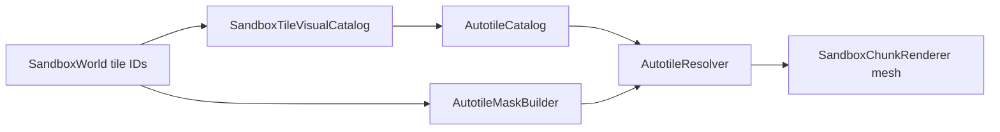

# Visual integration

> **Status:** Terrain autotiling and player avatar presentation use project-owned code under `Assets/Scripts/Visual/`.
> **Decisions:** Sandbox simulation owns tile IDs; visuals resolve at render/compose time only.
> **Invariants:** World state stores tile IDs; `SandboxTileVisualCatalog` maps IDs to autotile tileset names.

## Overview

| System | ProjectTwelve touchpoints |
|--------|-------------------------|
| Terrain autotiles | `AutotileCatalog`, `AutotileResolver`, `AutotileMaskBuilder`, `SandboxTileVisualCatalog`, `SandboxChunkRenderer` |
| Player avatar | `CharacterComposer`, `LayeredCharacterVisual`, `CharacterLocomotionDriver`, `PlayerAvatarFactory`, `SandboxPlayerAvatarVisual` |
| Creatures (future) | `MonsterVisualCatalog`, `MonsterLocomotionDriver`, `MonsterSpawnHelper`, `MountCompositor` |

Licensed source art lives in the private **project-twelve-assets** git submodule at `Assets/_Licensed/`. Import paths: `Assets/_Licensed/config/visual-import.txt` (optional override: gitignored `config/visual-import.local-only.txt`).

## Data flow (terrain)

## Default tile mapping

| Sandbox tile ID | Ground tileset | Cover tileset |
|-----------------|----------------|---------------|
| Dirt | Humus | — |
| Grass | Humus | GrassA |
| Stone | Rocks | — |
| CopperOre | BricksA | — |
| IronOre | BricksB | — |
| SilverOre | BricksC | — |
| GoldOre | BricksD | — |

## Local setup

See [Visual setup](../VISUAL_SETUP.md) for machine configuration and import menu steps.

## Key files

| File | Role |
|------|------|
| `Assets/Scripts/Visual/Tiles/AutotileCatalog.cs` | Ground/cover tileset catalog |
| `Assets/Scripts/Visual/Tiles/AutotileResolver.cs` | Deterministic autotile resolution |
| `Assets/Scripts/Visual/Characters/CharacterComposer.cs` | Runtime hero layer merge |
| `Assets/Scripts/Integration/PlayerAvatarFactory.cs` | Avatar spawn |
| `Assets/Scripts/Integration/LocalImportConfig.cs` | Submodule/override import path reader |

## See also

- [Visual behavior spec](../VISUAL_BEHAVIOR_SPEC.md)
- [Rendering and Collision](rendering-and-collision.md)
- [Asset integration requirements](15-assets-integration.md)
